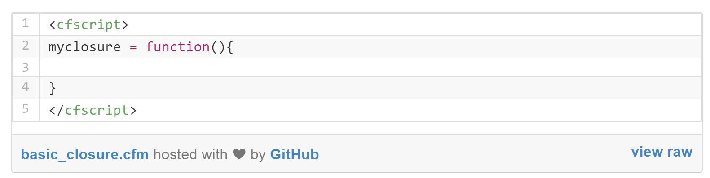

# About This Book

##Examples
All examples in this book are stored on github and public for you to download. You'll see an example file like this below. You can click on the  file name in the lower left corner to be taken to the github repository for the example. Examples are built using github Gists, and each Gist usually contains a few related examples. There is also a Testbox test case with each Gist.

[View All Example Gists](https://rorylaitila.gitbooks.io/lucee/content/gist_examples_directory.html)

