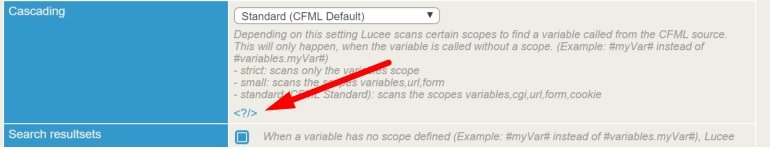
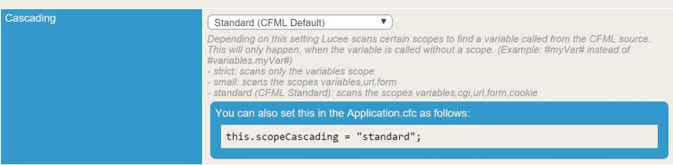

# Application.cfc Settings

Nearly all features of Lucee can be controlled on a per application basis. The easiest way to learn about the features that can be controlled is to browse the Lucee Administrator. Most features in the Admin will tell you how to override them in your Application.cfc if you choose to.

When you click the <?/> it will expand in to the setting that can be put into your Application.cfc

##Application Settings
These are the available settings which can be placed into your Lucee Application.cfc

| Setting Name | Type | Default Value | Description | Example |
| -- | -- | -- | -- |
| this.applicationTimeout | timeSpan | 1 Day | The length of time that Lucee should keep [application variables](https://rorylaitila.gitbooks.io/lucee/content/lifecycle_scopes.html#application) alive before clearing them. | `this.applicationTimeout = createTimeSpan( 1, 0, 0, 0 );`
| this.locale | string | en_US | The default locale to use in the Application. The locale is used in timezone, currency and other functions which rely on a geographic location. | `this.locale = "en_US";`|
| this.name | string | "" | The name for the application. This defines how Lucee knows which application is running, and which application variables to lookup. Each Application should always define a name. | `this.name = "myapp";` |
| this.timezone | string | America/New_York | Time timezone used by the application. The timezone is used in data/time functions to ensure the proper timezone output of the application. Although the default is America/New_York, most applications should use UTC for displaying and particularly, storing times. See how the timezone affects date manipulation in [Dates](https://rorylaitila.gitbooks.io/lucee/content/dates.html) | `this.timezone = "UTC";`
| this.typeChecking | boolean | true | Tells Lucee whether or not to type check arguments and return values to functions. Setting this to false can speed up some production applications. | `this.typeChecking = false;` |
