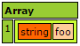
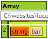
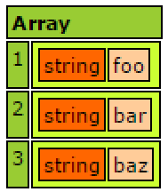

# Arrays Examples

Lucee Array indexes start at 1 and are passed by reference. If the elements in the array are Boolean, Numeric or Strings (simple values) they are passed by value. All other complex types are passed by reference. 

Lucee does not have Array types, wherein all members of an array must be of a certain type. An array in Lucee can hold any type. 

##Creating Arrays

Arrays can be created with elements or empty and elements added later.

###Create an Array with some elements


###Create an Empty Array



###Appending Elements to an Array



##Array Types (aka Typed Arrays)
Lucee can constrain all elements in the array to be of a certain type. This is accomplished by adding `[]` to the type signature. This is useful when you know that the array used or returned by a function, will always be of the same type. Consider the following function which returns a string:



When running this code, it will output: `foo`

This type signature can be updated to return an array of strings like so:



When running this code, it will output an array:

With the Typed Array being expected, if the function now returns a string, we will see that it errors like this in example:



Which errors with `can't cast String [foo] to a value of type [string[]]`

It is also possible to pass Typed Arrays as arguments to a function:



Which would output:

##Referencing Arrays



###Dyanmic References
Dynamic variables work as expected



##Dumping Arrays

Dumping an array like in this following example:



Will look like: 

##Looping Arrays

###For In Loop



###Loop Tag



###Loop Tag with with Index



###Each



###For Loop

This is the classic method of looping over an array, and similar to javascript. However the previous methods is a little less verbose.



##Advanced Array Usage

Arrays have many functions, see all uses here: http://luceedocs.herokuapp.com/objects

>Note: The member functions available on the Array object like .sort() duplicate the older "Built in Function" (BIF) style (like arraySort()). Modern convention is to use the new style, but the old BIFs are still provided for compatibility with older versions of Lucee.

