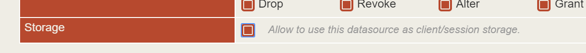
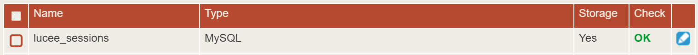
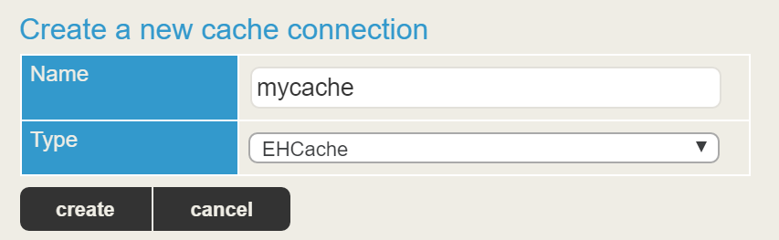
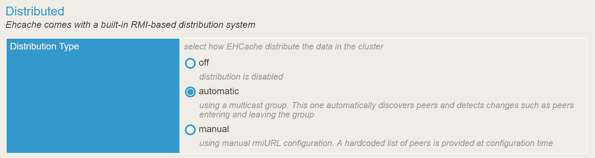
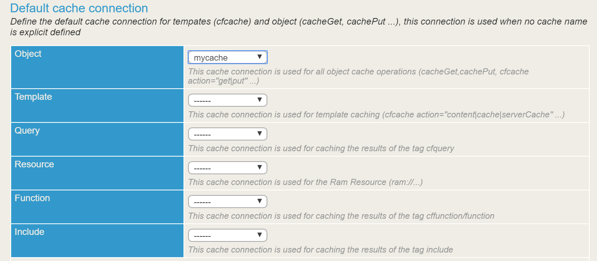

# Clustering
Clustering allows sharing data among multiple Lucee server instances for load balancing and failover. Currently the only *variable scopes* that can be shared across the cluster are Session and Client variables. To share other types of data across instances, store the data in a database, or configure a distributed cache. Lucee does not have specific "clustering" settings, but supports features which enable you to develop applications in a clustered manner.

##Clustering Considerations
Sharing data across a cluster has drawbacks and is not a universal solution to all performance and data sharing needs. Implementing the following recommendations will make clustering easier to achieve.

###Load Balancers
Lucee itself does not provide routing and load balancing, as this is handled by a web server (Apache, IIS, NginX). Typically Lucee is installed with Apache, and this guide describes how to configure a basic Apache load balancer. However there are many load balancing solutions. If Lucee is configured for clustering, any load balancer that you deploy should work as well as any other at the Lucee layer.

###Stateless Applications
Avoid storing application and user state in global variables (application, session, client) if this data needs to be available and synchronized across the cluster. Every bit of data that needs to be shared opens up opportunity to race conditions or forgetting to synchronize the data. Instead, keep the Lucee application *stateless* by loading all of the data necessary for each request on every request, and then naturally any request can be served by any Lucee instance in the cluster. Only seek to share the data across the cluster which is causing performance bottlenecks.

###Use Sticky Sessions
When configuring your load balancer, *sticky sessions* will ensure that a single Lucee instance serves the same user for the entire time that the user is engaged. Using sticky sessions will limit opportunities for race conditions, where saving/reading session data is not synchronized in time across instances in the cluster between requests. This is most an issue in ajax heavy applications which may fire multiple requests to the cluster at the same time.


##Enabling Session Clustering
Multiple Lucee instances can share session data by storing the session data a database. While this incurs a performance penalty, storing sessions in a database confers the following benefits: 

* Sessions are still available if Lucee is restarted
* If a Lucee instance failes, the session will be available on another instance
* Frees up memory on the Lucee instance

>Note: Session data can be stored in your primary database, or another database dedicated just for sessions. If you want your session storage to not be impacted by performance issues of your primary database, consider creating a dedicated database just for sessions. This article sets up a dedicated database.

The steps below are for a MySQL database, but any SQL database can be used for session storage. 

###Create the MySQL database
The statements below will create a database & user. Refer to the documentation for your specific database.



<noscript>
```
CREATE DATABASE lucee_sessions;
CREATE USER lucee_sessions@'localhost' identified by '123456';
GRANT ALL ON lucee_sessions.* to lucee_sessions@'localhost' identified by '123456';
FLUSH PRIVILEGES;
```
</noscript>

###Configure the datasource in Lucee

[Configure the datasource in Lucee](https://rorylaitila.gitbooks.io/lucee/content/sqlrdbms.html) to allow session/client storage. This is like any other datasource, but be sure to check an additional option: "Allow to use this datasource as client/session storage."



If the datasource is configured correctly, you should see a "Yes" in the storage column on the datasources page:



###Setup Application.cfc

Tell your Lucee Application to use the datasource for session storage. We also copied the datasource details from the admin into the Application.cfc so that our configuration is portable. 



<noscript>
```
component {

	this.datasources["lucee_sessions"] = {
		  class: 'org.gjt.mm.mysql.Driver'
		, connectionString: 'jdbc:mysql://localhost:3306/lucee_sessions?useUnicode=true&characterEncoding=UTF-8&useLegacyDatetimeCode=true'
		, username: 'lucee_sessions'
		, password: "encrypted:149560f5791fa0a32a4038bf23d139a8056de2594ee6ceab"
		
		// optional settings
		, storage:true // default: false
	};

	this.sessionTimeout = createTimeSpan(0,0,20,0); //Set a default session timeout of 20 minutes
	this.sessionStorage = "lucee_sessions"; //Set our session storage to the lucee_sessions datasource
}
```
</noscript>

###Run your Lucee Application
The first time your application loads, Lucee should create a table called cf_session_data with a session in it that looks like this:


###Add Indexing
For MySQL and databases supporting indexing, its recommended to add a primary key index to the generated table. This will improve performance for large numbers of sessions. The example below is for MySQL. See your database documentation for adding a primary key:



<noscript>
```
USE lucee_sessions;
ALTER TABLE cf_session_data ADD PRIMARY KEY(cfid,name);
```
</noscript>


> Note All manipulations with session data are always performed in memory. Only after session become inactive for about 10 sec Lucee will dump session data to database and free up memory. Every 1 hour Lucee automatically cleans database from expired sessions (session timeout value).

https://github.com/getrailo/railo/wiki/Using-database-for-session-data-storage

##Enabling Client Clustering
Enabled client storage is the same as session storage above, but the Application.cfc simply needs to enable client storage. This will create a table "cf_client_data" along with the "cf_session_data" table. Usually client and session data is used together, but you could only use client storage if needed. 



<noscript>
```
component {

	this.datasources["lucee_sessions"] = {
		  class: 'org.gjt.mm.mysql.Driver'
		, connectionString: 'jdbc:mysql://192.168.33.10:3306/lucee_sessions?useUnicode=true&characterEncoding=UTF-8&useLegacyDatetimeCode=true'
		, username: 'lucee_sessions'
		, password: "encrypted:8c3ea865feab8133a7614f58aee150cddee0ed6f82a476f1"
		
		// optional settings
		, storage:true // default: false
	};

	this.sessionTimeout = createTimeSpan(0,0,20,0); //Set a default session timeout of 20 minutes
	this.sessionStorage = "lucee_sessions"; //Set our session storage to the lucee_sessions datasource

	this.clientTimeout = createTimeSpan(0,1,0,0);
	this.clientManagement = true;
	this.clientStorage = "lucee_sessions";

	function onSessionStart(){
		session.someData = "My Data";
	}

	function onRequestStart(){
		client.myData = "My Client Data";
	}
}
```
</noscript>

##Enabling Cache Replication
For sharing complex data across a cluster that is not related to a specific user session or client scope, use a Lucee EHCache that is enabled for distributed replication. The [caching strategies](https://rorylaitila.gitbooks.io/lucee/content/caching.html) that can be used with the distributed cache are:

* Functions
* Objects (CFCs, structs & arrays)
* Queries
* Templates
* Includes

This section deals merely with configuring the distributed cache between two Lucee instances. For general caching setup see the caching section.

Setting up a distributed cache is as simple as configuring an EHCache on two Lucee instances. The following requirements must be met:

1. The cache on every Lucee instance share the same name
2. Each Lucee instance is on the same network and can reach each other
  3. While it is possible to configure a distributed cache between instances not on the same network, this is an advanced scenario and is not discussed here. A good understanding of [EHCache](http://www.ehcache.org/) for an advanced configuration.

**For Each Lucee Instance Do the Following**

###1. Setup The Cache
In the Lucee Admin, go to Services > Cache

####Create a EHCache



####Enable Distributed

Switch the Distribution Type from "off" to "automatic"



####Set the Default Cache Types
Go back to Services > Cache and set the default cache types that you want shared between these caches. This gives a lot of flexibility for some types to be distributed, and others not. There can be only one default type per cache. Each type will need its own distributed cache to share that type. 




Community Notes:

- http://stackoverflow.com/questions/31053742/railo-lucee-ehcache-sessionstorage-not-synchronizing