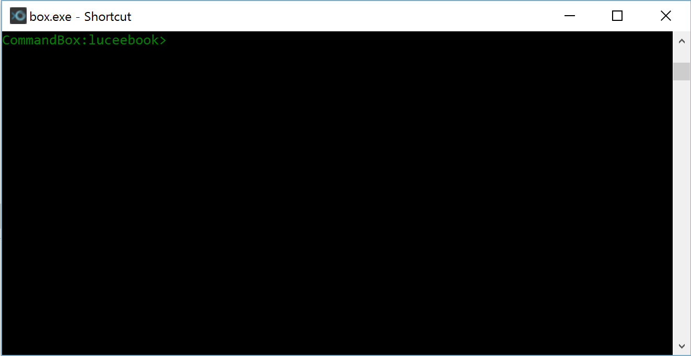
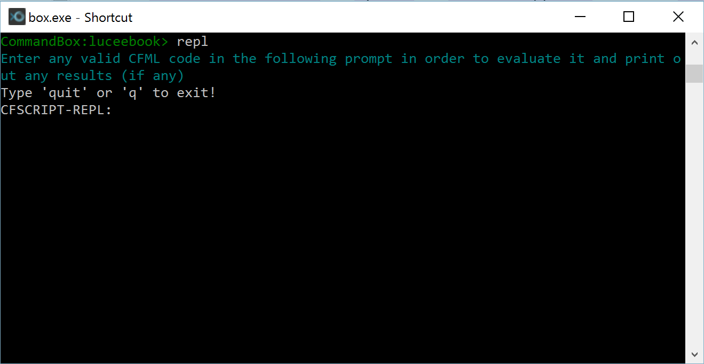
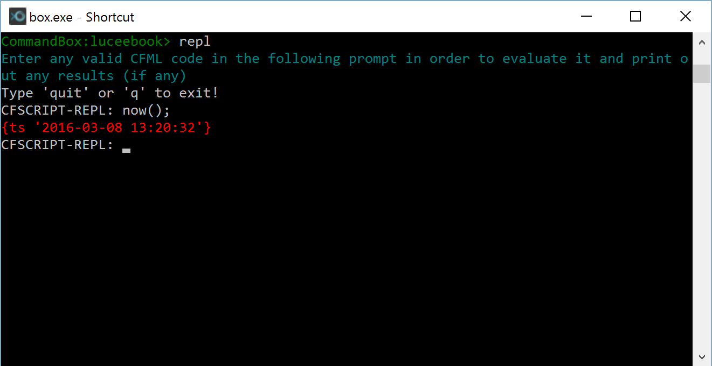

# Command Line REPL

Lucee has a Command Line REPL (Read Eval Print Loop) via CommandBox that is useful for CLI (command line interface) applications or testing out simple code snippets. This article assumes that you have [CommandBox Installed](https://rorylaitila.gitbooks.io/lucee/content/lucee_server.html). See a full tutorial for [CommandBox REPL](https://ortus.gitbooks.io/commandbox-documentation/content/usage/repl.html)

##Accessing the REPL
Open CommandBox and it should look something like this:

Then type "repl":

>repl

Which should look like this:

Now you can type any Lucee code, hit enter and it will be evaluated. For example, outputting the current date and time, type:

>now();

And hit enter

You can find out more features of the REPL in the [CommandBox documentation](https://ortus.gitbooks.io/commandbox-documentation/content/usage/repl.html)

