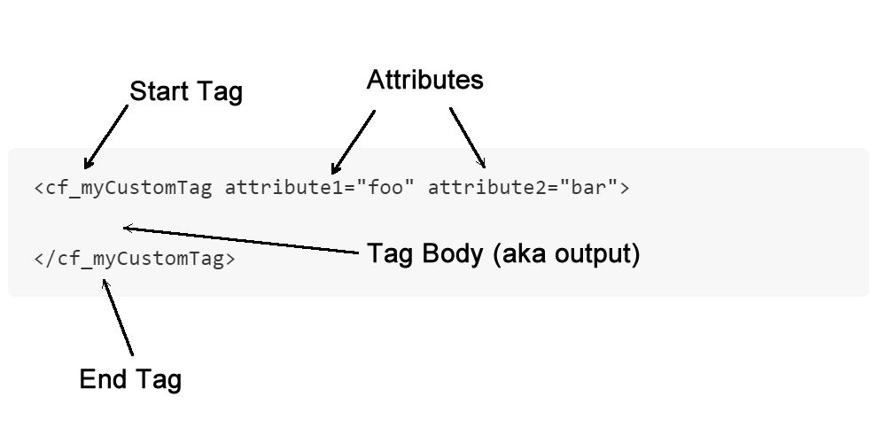
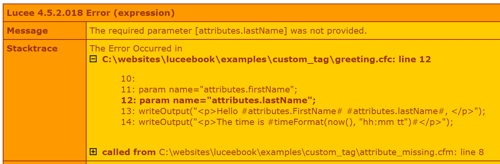

# Creating Custom Tags

Lucee custom tags are created with Components that follow a particular convention. The Compoenent can contain any code, but as long as it contains the functions Lucee is looking for as a custom tag, it can be used as a custom tag.

The special conventions that make a component a custom tag are:

* [Handling the start tag](#handling-the-start-tag) 
* [Handling the end tag](#handling-the-end-tag)
* Handling output
* Handling Attributes

When describing a custom tag, these conventions above map to areas in the code when using a custom tag. Consider this custom tag below:

```
<cf_myCustomTag attribute1="foo" attribute2="bar">

</cf_myCustomTag>
```

The important execution areas to be aware of are as follows:



Handling all of these execution areas is done in a single Component.

##Handling the Start Tag
When executing a custom tag, Lucee looks for a function in the component called onStartTag() and it calls it.

Here is an example of a minimal custom tag:



To execute this tag, use:



It will output: `Hello there!`

###onStartTag arguments
When Lucee calls the onStartTag, it provides the arguments specified in the example above. the onStartTag() function should be written so that it handles all of these arguments.

####Attributes
Lucee will pass to onStartTag, a struct containing all of the attributes in the start tag area. The onStartTag() function can use these attributes to perform actions, looking data or do anything the custom tag should be allowed to do. 

####Caller
Lucee will pass a *reference* to the variables scope of the .cfm template which is calling the custom tag. This allows the custom tag to inject data into the script which is using the custom tag, that the script may use. 

###onStartTag return value (boolean)
onStartTag() should return a true or false, which controls if the body of the tag should be executed. This is useful for tags which do not have bodies `<cf_nobody>`, or for when the custom tag needs to skip the body based on the values of the attributes or some other need.

##Handling the End Tag
Lucee handles the end tag by calling the function onEndTag() in the Component. Lucee does this for normal full closing tags, and self closing tags. 

>#### A note about Self Closing Tags
A self closing tag is when the custom tag does not have a tag body, but has a closing slash (/) for example: `<cf_basicTag />`. In a self closing tag, Lucee will call onEndTag() just as if the tag had a body like `<cf_basicTag>body</cf_basicTag>`. If the tag does not close like <cf_basicTag> then Lucee will not call onEndTag()


Consider this example of a custom tag we created to output the invite to a party:



What this tag is going to do is take an invitee supplied as an attribute, create a salutation for them and then output the paragraph for the invitation. The example would output: 

```
Hello Jimmy,

I'd like to let you know that you are invited to our party!
```

To implement this custom tag, we used the following:



###onEndTag Arguments
The arguments passed to the onEndTag allow for controlling what happens to the content between the start and end tags

####Attributes
Just like the onStartTag, the onEndTag gets the attributes from the start tag. This is often used to control or change the content of the text between the tags.

####Caller
Just like the onStartTag, the onEndTag also gets a reference to the variables scope of the calling template. 

####GeneratedContent
This argument is the unique difference with onEndTag. What Lucee passed to generatedContent is all of the executed content between the start and end tags. This allows the onEndTag function to manipulate that content. In the example above, it merely output the content, but it could also be changed, for exmaple, we could upper case all of the content:



And then execute the script:



```
Hello Jimmy,

I'D LIKE TO LET YOU KNOW THAT YOU ARE INVITED TO OUR PARTY!
```

##Handling Attributes
The attributes used in the custom tag which are passed to the onStartTag() and onEndTag() functions is simply a structure and so Lucee has additional support for managing and validating the attributes. The first method using the `param` statement is a standard Lucee feature, and there is an additional `metadata` feature specifically for custom tags.

###Param
The most simple method is to use the [param statement](http://luceedocs.herokuapp.com/tag/cfparam) to ensure that parameters are supplied or have defaults. For example if given this template using the custom tag cf_greeting before, the difference with this example is the last name was not passed:



And the code for the custom tag:



There are two important lines in the custom tag:

```
param name="attributes.firstName";
param name="attributes.lastName";
```

This tells Lucee that these variables `attributes.firstName` and `attributes.lastName` must be present, or error. Therefore our example generates an error because the last name was not supplied:




It is also possible to specify defaults, thereby making the attribute optional, and our error will go away:



If we run this template we'll get the output with the last name of Smith:



```
Hello Jim smith,

The time is 07:10 AM
```

###Custom Tag Metadata
Lucee provides a special metadata variable for controlling attributes. These metadata variables are set in the implicit consturctor are of the component. There are two types of metadata variables that can be set, `this.metadata.attributetype` and `this.metadata.attributes`

####this.metadata.attributetype

This controls how attributes are handled in bulk, there are two options:

| Value | Default | Description | 
| -- | -- | -- |
| dynamic | yes | Any attributes supplied to the tag are allowed. This is how custom tags work by default.|
| fixed | no | Only the attributes specified with metadata.attrbutes are allowed |

In this example, we define a custom tag that is fixed with only two attributes, firstName & lastName:



If we then call this custom tag passing in an attribute that is not defined, it will throw an error. For example:




