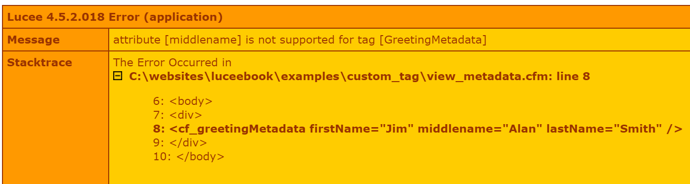
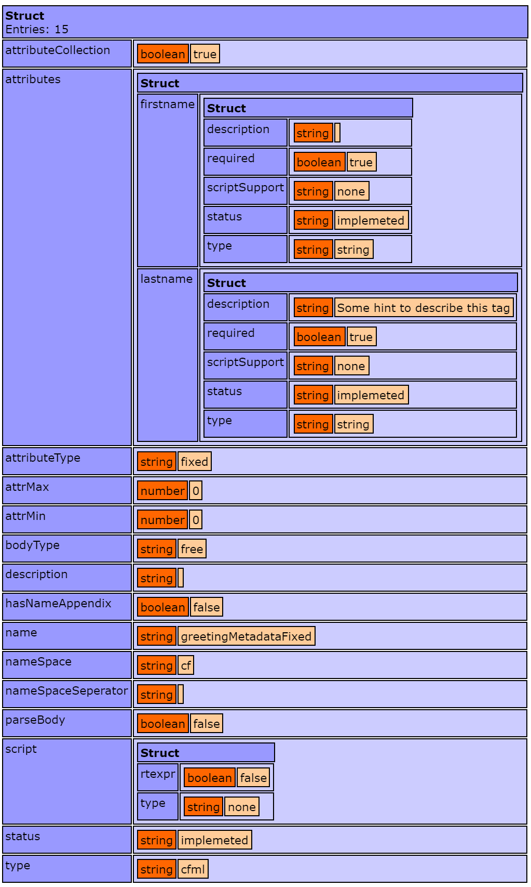

# Creating Custom Tags

Lucee custom tags are created with Components that follow a particular convention. The Compoenent can contain any code, but as long as it contains the functions Lucee is looking for as a custom tag, it can be used as a custom tag.

The special conventions that make a component a custom tag are:

* [Handling the start tag](#handling-the-start-tag) 
* [Handling the end tag](#handling-the-end-tag)
* [Handling Attributes](#handling-attributes)
* [Handling output](#handling-output)

When describing a custom tag, these conventions above map to areas in the code when using a custom tag. Consider this custom tag below:

```
<cf_myCustomTag attribute1="foo" attribute2="bar">

</cf_myCustomTag>
```

The important execution areas to be aware of are as follows:


Handling all of these execution areas is done in a single Component.

##Handling the Start Tag
When executing a custom tag, Lucee looks for a function in the component called onStartTag() and it calls it.

Here is an example of a minimal custom tag:



To execute this tag, use:



It will output: `Hello there!`

###onStartTag arguments
When Lucee calls the onStartTag, it provides the arguments specified in the example above. the onStartTag() function should be written so that it handles all of these arguments.

####Attributes
Lucee will pass to onStartTag, a struct containing all of the attributes in the start tag area. The onStartTag() function can use these attributes to perform actions, looking data or do anything the custom tag should be allowed to do. 

####Caller
Lucee will pass a *reference* to the variables scope of the .cfm template which is calling the custom tag. This allows the custom tag to inject data into the script which is using the custom tag, that the script may use. 

###onStartTag return value (boolean)
onStartTag() should return a true or false, which controls if the body of the tag should be executed. This is useful for tags which do not have bodies `<cf_nobody>`, or for when the custom tag needs to skip the body based on the values of the attributes or some other need.

##Handling the End Tag
Lucee handles the end tag by calling the function onEndTag() in the Component. Lucee does this for normal full closing tags, and self closing tags. 

>#### A note about Self Closing Tags
A self closing tag is when the custom tag does not have a tag body, but has a closing slash (/) for example: `<cf_basicTag />`. In a self closing tag, Lucee will call onEndTag() just as if the tag had a body like `<cf_basicTag>body</cf_basicTag>`. If the tag does not close like <cf_basicTag> then Lucee will not call onEndTag()


Consider this example of a custom tag we created to output the invite to a party:



What this tag is going to do is take an invitee supplied as an attribute, create a salutation for them and then output the paragraph for the invitation. The example would output: 

```
Hello Jimmy,

I'd like to let you know that you are invited to our party!
```

To implement this custom tag, we used the following:



###onEndTag Arguments
The arguments passed to the onEndTag allow for controlling what happens to the content between the start and end tags

####Attributes
Just like the onStartTag, the onEndTag gets the attributes from the start tag. This is often used to control or change the content of the text between the tags.

####Caller
Just like the onStartTag, the onEndTag also gets a reference to the variables scope of the calling template. 

####GeneratedContent
This argument is the unique difference with onEndTag. What Lucee passed to generatedContent is all of the executed content between the start and end tags. This allows the onEndTag function to manipulate that content. In the example above, it merely output the content, but it could also be changed, for exmaple, we could upper case all of the content:



And then execute the script:



```
Hello Jimmy,

I'D LIKE TO LET YOU KNOW THAT YOU ARE INVITED TO OUR PARTY!
```

##Handling Attributes
The attributes used in the custom tag which are passed to the onStartTag() and onEndTag() functions is simply a structure and so Lucee has additional support for managing and validating the attributes. The first method using the `param` statement is a standard Lucee feature, and there is an additional `metadata` feature specifically for custom tags.

###Param
The most simple method is to use the [param statement](http://luceedocs.herokuapp.com/tag/cfparam) to ensure that parameters are supplied or have defaults. For example this template used the cf_greeting as before but is now missing the last name:



And the code for the custom tag:



There are two important lines in the custom tag:

```
param name="attributes.firstName";
param name="attributes.lastName";
```

This tells Lucee that these variables `attributes.firstName` and `attributes.lastName` must be present, or error. Therefore our example throws an error "The required parameter [attributes.lastName] was not provided." because the last name was not supplied:


It is also possible to specify defaults, thereby making the attribute optional, and our error will go away:



If we run this template we'll get the output with the last name of Smith:



```
Hello Jim smith,

The time is 07:10 AM
```

###Custom Tag Metadata
Lucee provides a special metadata variable for controlling attributes. These metadata variables are set in the implicit consturctor area of the component. There are two types of metadata variables that can be set, `this.metadata.attributetype` and `this.metadata.attributes`

####this.metadata.attributetype

This controls how attributes are handled in bulk, there are two options:

| Value | Default | Description | 
| -- | -- | -- |
| dynamic | yes | Any attributes supplied to the tag are allowed. This is how custom tags work by default.|
| fixed | no | Only the attributes specified with metadata.attrbutes are allowed |
<br />

In this example, we define a custom tag that is fixed with only two attributes, firstName & lastName:
<br /><br />



If we then call this custom tag passing in an attribute that is not defined, it will throw the error "attribute [middlename] is not supported for tag [GreetingMetadata]". For example:






####this.metadata.attributes

Like in the preceding example with the `this.metadata.attributetype=fixed`, it used an additional `this.metadata.attributes` setting. This additional setting allows defining what attributes are required, optional, or have defaults. Each attribute should be defined on its own, and it takes a structure of options. In the example we define two required attributes:

```
this.metadata.attributes.firstName={required:true,type:"string"};
this.metadata.attributes.lastName={required:true,type:"string"};
```

Each attribute can have the following options:

| Option | Default | Description |
| -- | -- | -- |
| required | false | Whether the attribute is required to be passed |
| type | any | The Lucee type that this attribute must be. See [Lucee Types](https://rorylaitila.gitbooks.io/lucee/content/types.html) for a listing of available types. |
| default |  | A default value for this attribute |
| hint | | A hint to supply Lucee for automatic documentation when the custom tag is installed as a core tag |

#####Attribute Hints
When a hint is specified for the metadata attribute, and the tag is installed to Lucee as described in [Custom Tags Loaded at Lucee Startup](https://rorylaitila.gitbooks.io/lucee/content/calling_custom_tags.html#custom-tags-loaded-at-lucee-startup), Lucee will read that hint to produce documentation using the `getTagData()` function. This is useful for autogenerating documentation about custom tags.



Which would produce the output:



##Handling Output

There are three common use cases for handling output and returning data from a custom tag. Custom tags are most often used in the view layer to create reusable view components.

1. Outputting attribute data and text
2. Working with and outputting the tag body
3. Injecting data into the caller scope

###Outputting attribute data and text
The easiest method of outputting data is to just call `echo()` (or `writeOutput()`) anywhere from within the custom tag. Any text echo'd will be output at that location in the calling script. Consider one of view examples earlier in this article: 



When running this view, it outputs:

```
Hello Jim Smith,

The time is 07:06 AM
```

Within the custom tag, we see that the onStartTag() has the writeOutput which is writing the text to the page:



###Working with and outputting the tag body
Custom tags become more powerful when working with and manipulating the tag body content. The tag body is passed to the onEndTag() generatedContent parameter and can be manipulated with any string methods and then output to the page with writeOutput(). 

In an earlier example, we used the onEndTag() to upper case the body content. We repeat this example below. Consider this view:



Which when executed, outputs:

```
Hello Jimmy,

I'D LIKE TO LET YOU KNOW THAT YOU ARE INVITED TO OUR PARTY!
```

And the custom tag which implements this upper casing:



####Variables inside the tag body
It should be noted that any variables inside the tag body not surrounded by `<cfoutput></cfoutput>` tags will not be processed. Condier the following view which tries to output the year of the party:



This would output:

```
Hello Jimmy,

I'd like to let you know that you are invited to our party on #theDate#!
```

The variable `#theDate#` did not get processed because Lucee thought it was a string. There are two ways to get Lucee to process variables within the tag body. The first way, is to wrap the body in `<cfoutput>`:



When running this view, it will now output:

```
Hello Jimmy,

I'd like to let you know that you are invited to our party on 1999!
```

But what if we wanted to make a tag which could process the body content and resolve any variables, without the user having to remember to use `<cfoutput>`? This can be achieved by manipulating the generatedContent in onEndTag(). 

Consider this custom tag:



What is different about this version of the invite tag are these lines in the onEndTag():

```
structAppend(local, caller);
writeOutput(evaluate(de(generatedContent)));
```

The first line `structAppend(local, caller);` copies all of the variables from the caller view into the onEndTag's local variables scope. This is so that `theDate` can be found when it next parses the tag body text.

The second line `writeOutput(evaluate(de(generatedContent)));` outputs the generated content by evaluating it with the `evaluate()` function and the `de()` (delayed evaluation) function. In Lucee, strings can be evaluated with evaluate(), and de() can be used to evaluate an evaluated variable.

Thus by running a view using this new tag:



It will output the date properly:

```
Hello Jimmy,

I'd like to let you know that you are invited to our party on 1999!
```

###Injecting data into the caller scope
The final method of using custom tags is to put data directly into the view variables that the view can then use to output content. Continuing the examples above, an alternative view might be:



This view outputs the same result:

```
Hello Jimmy

I'd like to let you know that you are invited to our party!
```

The difference here is that the view is expecting two variables `#salutation#` and `#message#`,  but these variables were not set in the view. Instead they were set in the custom `<cf_inviteInject invitee="Jimmy">`:



The critical difference in this version of the invite is it is injecting variables into the caller scope:

```
caller.salutation = "Hello #attributes.invitee#";
caller.message = "I'd like to let you know that you are invited to our party!";
```

Both the onStartTag() and onEndTag() function receive a `caller` parameter. This parameter is a *reference* to the variables of the view. So any additional variables set into caller, then become available from the view.

When you might use this injection method vs. the previous output methods just depends on the purpose of the custom tag. Tags which wrap output text or manipulate the tag body text, usually will output directly. However tags which get data some somewhere else or use the attributes to create data which may be used in various ways by the view, might better inject the results as variables so that the view can choose what it wants to do with them.


