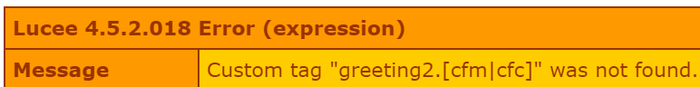

# Custom Tags

Lucee allows extending the language with custom tags to add functionality to your views. Custom tags are typically used for view logic. You create cutom tags with CFCs and then import them into your page.

##Example View with a Custom Tag

Consider the following HTML template which uses a custom tag, called greeting.



<noscript>
```
<html>
<head>
	<meta charset="UTF-8">
	<title>A Basic Custom Tag Example</title>
</head>
<body>
	<div>
		<cf_greeting firstName="Jim" lastName="Smith" />
	</div>
</body>
</html>
```
</noscript>

When running this script, it will output:

```
Hello Jim Smith,

The time is 06:43 AM
```

What happened here is we created a custom tag called greeting, passed a firstname & lastname to it, and the greeting tag generated the text for output. 

Here is what the greeting.cfc custom tag looks like. Further on in this articule it will be explained.



<noscript>
```
component {

	/**
	 * Invoked during the start of the custom tag
	 * @param  {struct} required struct        attributes The attributes passed to the custom tag
	 * @param  {struct} required struct        caller     A reference to the variables scope from the location that calls the custom tag
	 * @return {boolean}          To control whether to execute the body of the custom tag
	 */
	public boolean function onStartTag(required struct attributes, required struct caller){

		param name="attributes.firstName";
		param name="attributes.lastName";
		writeOutput("<p>Hello #attributes.FirstName# #attributes.lastName#, </p>");
		writeOutput("<p>The time is #timeFormat(now(), "hh:mm tt")#</p>");
		return false;
	}

	/**
	 * Invoked after the completion of the closing tag
	 * @param  {struct} required struct        attributes The attributes passed to the custom tag
	 * @param  {struct} required struct        caller     A reference to the variables scope from the location that calls the custom tag
	 * @param  {string} string        output     The output generated between the start and end tags at the caller
	 * @return {boolean}          To control whether to execute the body of the custom tag
	 */
	public boolean function onEndTag(required struct attributes, required struct caller, string output){
		return false;
	}

}
```
</noscript>

##Calling Custom Tags
Before getting into how to build custom tags, its important to first know where Lucee looks for custom tags and how to call them. There are a few lookup rules:

1. Custom Tags in the same directory as the executing script
2. Custom Tags defined in a customtag path
4. Custom Tags loaded at Lucee startup

###Custom Tags in the Same Directory
If the custom tag is in the same directory as the view template executing the tag, Lucee can find the tag with the cf prefix. Consider the following directory structure (which is the structure of the above example).

- /
  - greeting.cfc
  - view.cfm

When executing the view.cfm template, and encountering the `<cf_greeting>` tag, Lucee looked for any matching tags in the same directory as view.cfm.

This basic lookup mechanism is useful when custom tags are only used by one view. But when used by multiple views, not all views would necessarily be in the same directory, so there are additional methods to find the tags.

###Custom Tags defined in a custom tag path
The Application.cfc can direct Lucee where to find custom tags with the setting: `this.customTagPaths`;

Consider this directory structure:

- /
  - /custom_tag
    - view_custom_tag.cfm
    - Application.cfc
  - /custom_tag_import
    - greeting2.cfc

Here was an additional custom tag, "greeting2" which will say "Good Day" instead of "Hello":



> Note: This is from a different github gist repository because gists do not support subdirectories

If view_custom_tag.cfm is looking for `<cf_greeting2>` custom tag, it wont find it in the same directory as itself and will error with something like this:



So the Application.cfc needs to tell Lucee where to look:



<noscript>
```
component {
	this.customTagPaths = ["../custom_tag_import"];
}
```
</noscript>

Then when the view is executed, Lucee can find the custom tag and will output:

```
Good Day Jim Smith,

The time is 07:04 AM
```

###Custom Tags loaded at Lucee startup
Any custom tags placed into the Lucee server context, or Web context, custom tag directory. Server context tags will be available to all web contexts, while web context tags will only be available to that specific web context.

The easiest way to find these directories is with the system directory placeholders:



<noscript>
```
<cfscript>
writeDump(expandPath("{lucee-server}/library/tag"));
writeDump(expandPath("{lucee-web}/library/tag"));
</cfscript>
```
</noscript>

Place any custom tags into the library/tag directory of the server or web context, and Lucee can find them.


