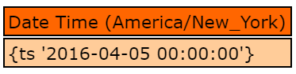
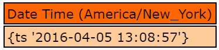

# Dates

Lucee has a built in DateTime object.

##Creating a Date & Time Object






Creating a Date only object using the createDate() function, simply creates a DateTime object, but the Time is 0. This is handy when only the date is needed and not the time.




##Working with DateTime objects
The Lucee DateTime object has a number of functons, refer to the [DateTime object reference](http://luceedocs.herokuapp.com/objects). We show an example here to get you started

###Comparing Dates

The following example shows comparing dates with each other. the dateTime.compare() function works on a date time. It returns -1 if the date is before another date, 1 if it is after, and 0 if they are the same.



The echo's from this example return:

```
myDate should be before myDate2: -1
myDate2 should be after myDate: 1 
myDate should be equal to otherDate: 0
```

##Working with Timezones
A Lucee datetime object is independent of a specific timezone, it is only a offset in milliseconds from 1970-1-1 00.00:00 UTC (Coordinated Universal Time). When dumping a dateTime object, Lucee is actually formatting it for the timezone of the Lucee server, but that timezone is not a part of the datetime object itself.

To set a specific timezone for your application, use the `this.timezone' setting in the Application.cfc



<noscript>
```
component {
	this.timezone = "UTC";
}
```
</noscript>

Because timezones are not a part of the datetime object, this means that the timezone only comes into play when you need specific information like hours in a day, minutes in a hour or which day it is since those calculations depend on the timezone. For these calculations, a timezone must be specified in order to translate the date object to something else. If you do not provide the timezone in the function call, it will default to the timezone specified in the Lucee Administrator (Settings/Regional). You can find a list of all available timezones in the Lucee administrator (Settings/Regional). Some examples of valid timezones:

- AGT (for time in Argentina)
- Europe/Zurich (for time in Zurich/Switzerland)
- HST (Hawaiian Standard Time in the USA)

###Always store UTC
When persisting dates to a database, it is best practice to store dateTimes in UTC and convert them to the locale appropriate timezone for the user as a final step. This will keep datetimes accurate and error free from timezone changes or user preference changes.

Note with MySQL, there is an issue with timezone conversions by Lucee. Be sure to set the datasource config "Legacy Datetime Code" to false


See these articles:
* https://groups.google.com/forum/#!topic/lucee/WZvSozMB6-A
* https://issues.jboss.org/browse/RAILO-2555
* http://stackoverflow.com/questions/7605953/how-to-change-mysql-timezone-in-java-connection

###Timezone Example
This example shows how the datetime object is independent of the timezone. First it uses `setTimezone` to override the Lucee Application.cfc or Admin timezone, then it it gets the current time with `now()`, dumps it, then outputs the time in PST timezone. 



<noscript>
```
<cfscript>
setTimezone("America/New_York"); //Set a timezone for this request
myDate = now(); //Set the current time to now
writeDump(myDate);
writeDump(dateTimeFormat(myDate, "medium", "PST")); //But we can output into any other time zone
</cfscript>
```
</noscript>

The first dump outputs the America/New_York time:


And the second is converted to PST  (three hours earlier)


