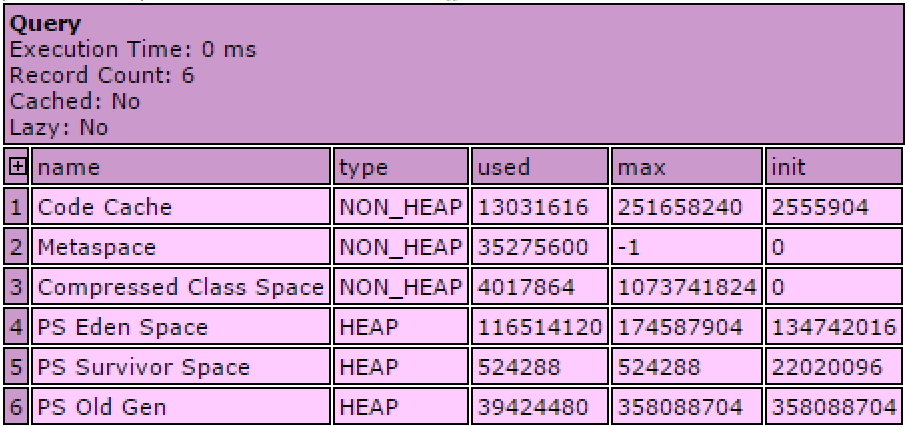

# Java Virtual Machine

Lucee is a Java servlet application and can be tuned like any Java application. Advanced JVM tuning strategies appropriate for any Java application can also apply to Lucee. This artlce discusses strategies for profiling the JVM and making adjustments. There are two primary tasks for any JVM tuning: monitoring memory and thread usage, and tuning the garbage collection.

For more in depth explanation of the JVM, see these resources:

## Monitoring Memory & Thread Usage

There are two areas to see memory usage by the JVM, in the Lucee administrator, and with the Java Visual VM tool, which is a part of the Java Development kit. The Lucee administrator is good for quick adjustments, and the Visual VM tool is good for complex issues and really understanding what the JVM is doing.

* Lucee getMemoryUsage\(\)
* Visual VM

### Lucee getMemoryUsage

Lucee provides a function 'getMemoryUsage\(\)' which will return the memory in use by the JVM that Lucee is running on. When output, it looks like:



### Java Visual VM

#### Configuration

Visual VM is run on a workstation like Windows or OSX, and it connects to a running Lucee server. Visual VM gives a graphical interface to inspect the running JVM process:  


To configure Visual VM you will need to install software on your Workstation/Desktop and also the Lucee server

1. [Workstation](#1-workstation)
2. Server
   1. Tomcat Configuration
   2. User Security
   3. Visual VM Script

#### Workstation Configuration

##### 1. Install the JDK

You will need to download/install the Java JDK on your workstation \(not the server!\) to use VisualVM. While backward compatability is sometimes available, as a best practice you should check the version of the JVM you are running tomcat on and use the same JDK verison.

Download URLs change frequently so use this: [https://www.google.com/?\#q=jdk+download](https://www.google.com/?#q=jdk+download)

##### 2. Open VisualVM

Open VisualVM \(it will be installed into the JDK, on Windows in something like: C:\Program Files\Java\jdk1.8.0\_131\bin\jvisualvm.exe\). You should see something like this:


##### 2. Install the VisualGC Plugin

In VisualVM, go to Tools &gt; Plugins &gt; Available Plugins and select "Visual GC" and click "Install  


You are now ready to connect to a running Lucee server once the server configuration below is finished.

#### Server Configuration

There are several Tomcat configurations that must be implemented along with a simple script. This article only discusses Tomcat, the default servlet container shipped for a production Lucee installation. At the end of this article there is a sample setup script which will perform all of these tasks.

##### 1. Install the full Java Development Kit

Be sure to install the full Java Development Kit for your installation. The JDK that ships with RedHat based distributions does not have the jstatd binary. For CentOS/RedHat, download the appropriate JDK rpm from Orcale and install it:

```
# Download and install the Java 8 SDK. The oracle site
# requires a specific accept cookie to be set, so we mimic a browser
wget --no-cookies --no-check-certificate --header "Cookie: gpw_e24=http%3A%2F%2Fwww.oracle.com%2F; oraclelicense=accept-securebackup-cookie" "http://download.oracle.com/otn-pub/java/jdk/8u151-b12/e758a0de34e24606bca991d704f6dcbf/jdk-8u151-linux-x64.rpm"
rpm -i jdk-8u151-linux-x64.rpm
```

For CentOS, the JDK will be installed to /usr/java/VERSION/, check the bin folder for the jstatd executable

##### 2.Tomcat Configuration

Update your setenv.sh config to include the following:

> export CATALINA\_OPTS="-Dcom.sun.management.jmxremote -Dcom.sun.management.jmxremote.port=8999 -Dcom.sun.management.jmxremote.ssl=false -Dcom.sun.management.jmxremote.authenticate=true -Djava.rmi.server.hostname=YOUR.IP.GOES.HERE -Dcom.sun.management.jmxremote.password.file=$CATALINA\_HOME/conf/jmxremote.password -Dcom.sun.management.jmxremote.access.file=$CATALINA\_HOME/conf/jmxremote.access";

Change 'YOUR.IP.GOES.HERE' to the local IP of the server.

You will need to restart tomcat after this change.

##### 3.User Security

You will need to create two files: /opt/lucee/tomcat/conf/jmxremote.access and /opt/lucee/tomcat/conf/jmxremote.password.

jmxremote.access manages permissions and looks like this:

```
userone readwrite
anotheruser readwrite
```

And jmxremote.password is implemented as follows:

```
userone c0mpl3xpass
anotheruser anotherpassword
```

##### 4. Create a Permissions File

Create a JVM permissions file that we will use when starting the visual vm process at /opt/lucee/tomcat/conf/tools.policy with the content:

```
grant codebase "file:\${java.home}/../lib/tools.jar" {
   permission java.security.AllPermission;
};
```

##### 5. VisualVM Script

In order for VisualVM to connect to the running server instance, the jstatd program needs to be running. Its easiest to create a shell script to execute this program:

```
#!/bin/bash
/usr/java/jdk1.8.0_151/bin/jstatd -J-Djava.security.policy=/opt/lucee/tomcat/conf/tools.policy -J-Djava.rmi.server.hostname=YOUR IP ADDRESS GOES HERE
```

Again, update `/your/local/path` as appropriate to the location of the JDK installed in step 1. Save it as `visualvm` or the like, with execute permissions. Run this from the command line while you are running VisualVM and terminate the process when complete.

The following snippet will create the start script

```
##Create a security polity file
cat > /root/bin/visualgc << EOF
#!/bin/bash
#/usr/java/jdk1.6.0_32/bin/jstatd -J-Djava.security.policy=/opt/lucee/tomcat/conf/tools.policy
/usr/java/jdk1.8.0_131/bin/jstatd -J-Djava.security.policy=/opt/lucee/tomcat/conf/tools.policy
EOF
```

#### Sample Script

The following script can be used to completely configure a Lucee server for management using all of the preceeding instructions. This is tested for Lucee 4.5 on CentOS 7.4

```bash
#!/bin/bash
##############################
## CONFIGURE JMX and jSTATd ##
##############################
# JMX and jStatD can be used to profile the server and check
# running connections, memory and CPU usage of the java process. 
# We need to install the java SDK and configure the settings

# VARIABLES 
# These variables are used in the script below. Set
# these to your desired values
JMX_HOST=YOUR IP ADDRESS GOES HERE
JMX_USERNAME=YOUR JMX USER NAME
JMX_PASSWORD=YOUR JMX USER PASSWORD

######################
## INSTALL JAVA SDK ##
######################
# Install an appropriate java SDK. This sample script
# Downloads SDK8. Version 9 does not work with VisualVM
wget --no-cookies --no-check-certificate --header "Cookie: gpw_e24=http%3A%2F%2Fwww.oracle.com%2F; oraclelicense=accept-securebackup-cookie" "http://download.oracle.com/otn-pub/java/jdk/8u151-b12/e758a0de34e24606bca991d704f6dcbf/jdk-8u151-linux-x64.rpm"
rpm -i jdk-8u151-linux-x64.rpm

#################################
## CONFIGURE LUCEE BOOT SCRIPT ##
#################################
# Remove the CATALINE_OPTS export because we are going to append it back to the end 
# after creatating more options
sed -i -e 's/export CATALINA_OPTS;//g' /opt/lucee/tomcat/bin/setenv.sh

# Setup the basic JMX options
echo "JMX_OPTS=\"-Dcom.sun.management.jmxremote -Dcom.sun.management.jmxremote.port=8999 -Dcom.sun.management.jmxremote.ssl=false -Dcom.sun.management.jmxremote.authenticate=true -Djava.rmi.server.hostname=${JMX_HOST} -Dcom.sun.management.jmxremote.password.file=\$CATALINA_HOME/conf/jmxremote.password -Dcom.sun.management.jmxremote.access.file=\$CATALINA_HOME/conf/jmxremote.access\"" >> /opt/lucee/tomcat/bin/setenv.sh

# Combine the original options plus the JMX options
echo "CATALINA_OPTS=\"\${CATALINA_OPTS} \${JMX_OPTS}\";" >> /opt/lucee/tomcat/bin/setenv.sh

# Replace the export which was removed earlier
echo "export CATALINA_OPTS;" >> /opt/lucee/tomcat/bin/setenv.sh

##############################
## CREATE USER ACCESS FILES ##
##############################
# These files tell Lucee/Java
# Who has access to manage the JVM remotely

# Create the password file
touch /opt/lucee/tomcat/conf/jmxremote.password 
echo "${JMX_USER} ${JMX_HOST}" > /opt/lucee/tomcat/conf/jmxremote.password
chmod 600 /opt/lucee/tomcat/conf/jmxremote.password

# Create the permissions file for the user
touch /opt/lucee/tomcat/conf/jmxremote.access
echo '${JMX_USER} readwrite' > /opt/lucee/tomcat/conf/jmxremote.access
# copy the above line for additional users
chmod 600 /opt/lucee/tomcat/conf/jmxremote.access

# Create a security policy file
cat > /opt/lucee/tomcat/conf/tools.policy << EOF
grant codebase "file:/usr/java/jdk1.8.0_151/lib/tools.jar" {
   permission java.security.AllPermission;
};
EOF

###################################
## CREATE SCRIPT TO START Jstatd ##
###################################
# The jstatd process which provides the 
# advanced memory profiling is not enabled by default
# we create a simple script that starts jstatd that
# you can run

# Create a script to start the jstatd process
cat > /root/bin/visualgc << EOF
#!/bin/bash
/usr/java/jdk1.8.0_151/bin/jstatd -J-Djava.security.policy=/opt/lucee/tomcat/conf/tools.policy -J-Djava.rmi.server.hostname=${JMX_HOST}
EOF
chmod 755 /root/bin/visualgc

##########################
## START Jstatd PROCESS ##
##########################
# start the jstatd process in the background if you want this running
# all of the time on your server. Alternatively, you can run this only
# when you need to profile
/root/bin/visualgc &
```

#### Connecting to the Lucee Server

With the server configuration complete, go back to VisualVM to add the remote server.

##### 1. Add Remote Host

Right click on "Remote" and select "Add Remote Host"


Add the IP address of your server from the configuration:


After a moment, you should now see two proceses on the remote host, jstatd and Tomcat


Jstatd is the process for connecting visualVM, you can ignore it. Tomcat is the Lucee process. 

##### 2. Connect to Tomcat

Double click on Tomcat and you will be prompted for your credentials:


If no errors are received, it means success. You can now double click on Tomcat again to open the management console, which looks like this:


You can now see the running Java memory on the "VisualGC" tab. 

> Note: In this view, performing garbage collections "Perform GC" and making heat dumps "Heat Dump" button appear to be disabled. See the Adding JMX connection section below to get access to these functions.

##### 3. Add JMX Connection

You may also add a JMX connection which allows for additional management features

Right click on the server in the remote section and select "Add JMX Connection"


Add 8999 to the port, \(or other port specified in the server configuration above, select "Use Security Credentials" and select "Do not require SSL connection". Enter your user credentials:


You should now have full access to the management feature.

