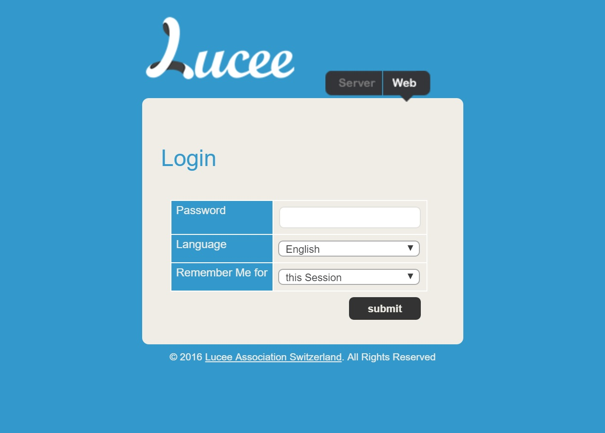

# Lucee Admin

Every Lucee installation comes with an Administrator that allows configuring settings about the Lucee process and websites. There are at least two Administrators, one for the [Server Context](lucee/content/lucee_context.html), and one for each website on server that is using Lucee ([Web Context](/lucee/content/lucee_context.html)).

To access the Administrator a running Lucee website, go to `yourdomain.com/lucee/admin/web.cfm` for the Web Context's Admin, and `yourdomain.comlucee/admin/server.cfm` for the Server Context's Admin

> Replace 'yourdomain.com' with whatever host Lucee is running in in your situation

You should see something like this:

>note: On the first time logging into the Server or Web admin interfaces, Lucee will prompt you for a password.