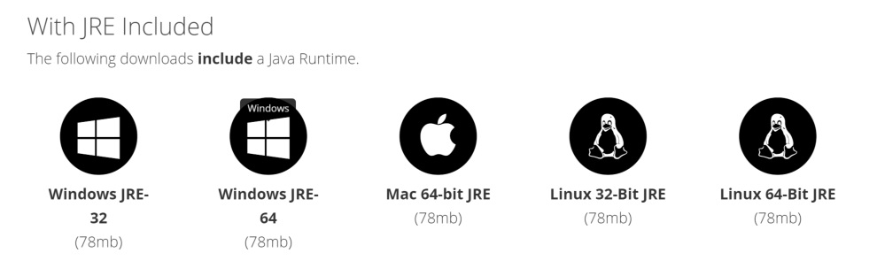
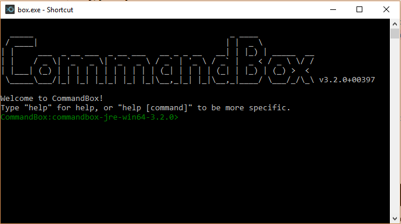
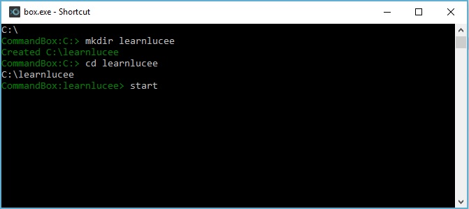
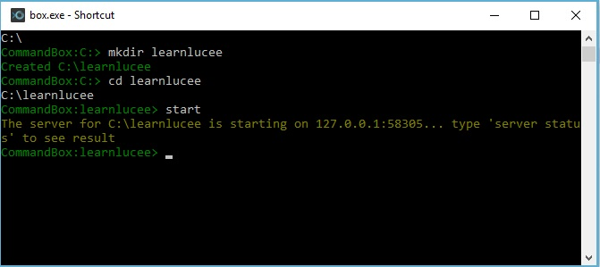
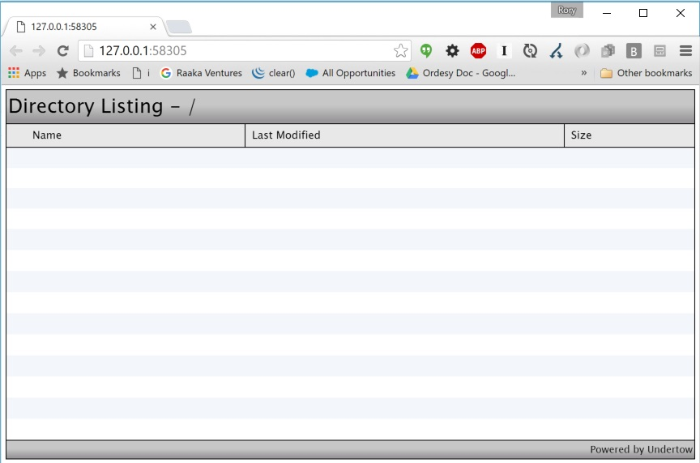

# Lucee Server

Lucee is a Java based application server and is deployed to Java Servlet containers like Tomcat. Lucee can be run behind a Web Server like Apache or Nginx to provide additional capabilities of those servers like mod_rewrite, caching and serving static files.

##Running Lucee for Development Quick Start
The easiest way to begin running Lucee is to utilize the [CommandBox](https://www.ortussolutions.com/products/commandbox) command line tool which can start and stop Lucee servers for development and try out the Lucee language. 

Read the [CommandBox documentation](http://commandbox.ortusbooks.com/content/) for full capabilities on running a [server](https://ortus.gitbooks.io/commandbox-documentation/content/embedded_server/embedded_server.html)

###Step 1
Download [CommandBox](https://www.ortussolutions.com/products/commandbox) for your OS and follow the installation instructions. Full instructions can be found in the [CommandBox Instructions](https://ortus.gitbooks.io/commandbox-documentation/content/setup/installation.html)

###Step 2
Start CommandBox by running the box.exe (Windows) or executing the binary (Mac & Linux). You can make the binary system wide by [following instructions for your platform](https://ortus.gitbooks.io/commandbox-documentation/content/setup/installation.html).

###Step 3
Path to any directory in command box and type start. CommandBox will start a Lucee server in this directory and open your web browser and show a file directory of where it was started. If you place any .cfm files in this directory you will be able to execute them. 

The above image shows three commands being executed: 

> mkdir learnlucee 

This create a directory to store my files for development. CommandBox can work from any directories that you create to store Lucee scripts. 

> cd learnlucee

This "change directory" (cd) command put me into the learnlucee folder

> start

This started up Lucee on a random port (it picks one that is available but you can manually set this yourself, see the [documentation](https://ortus.gitbooks.io/commandbox-documentation/content/embedded_server/embedded_server.html)). 

Once it has finihsed starting, CommandBox automatically opened the running Lucee in the default browser, which in this example is showing a list of the (empty) learnlucee directory. Files can now be added to this directory to execute Lucee templates.

