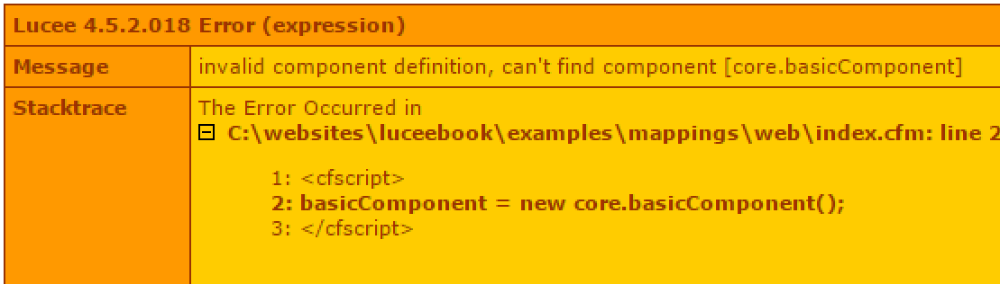

# Mappings (Class Paths)

By default, all instances of Lucee Components and Templates are located starting from the webroot of the application. Mappings are used typically used to locate files outside of the webroot

Take for example the following directory structure

* /
  * /core
    * include.cfm
    * basicComponent.cfc
  * /web
    * /subfolder
      * view.cfm
    * Application.cfc
    * index.cfm
  

>Note: In this example, the web server is running from the /web directory, and therefore /core/include.cfm can not be browsed directly from a browser.

Consider index.cfm which tries to instantiate basicComponent.cfc:

```
<cfscript>
basicComponent = new core.basicComponent();
</cfscript>
```

Because basicComponent is not in the web root, without a mapping, Lucee would error with:




In order for Lucee to find this component, it needs a mapping in the Application.cfc

```
component {
	this.mappings["/core"] = "../core";	
}
```

Now Lucee can find the component.

##Defining Mappings Explained

The Application.cfc has a setting `this.mappings` which is a structure. Each key in the stucture is a mapping, and each value is a relative path starting from the web root. The value can also be an absolute system path. 

###Absolute Path
```
component {
	this.mappings["/core"] = "../core";	
}
```

