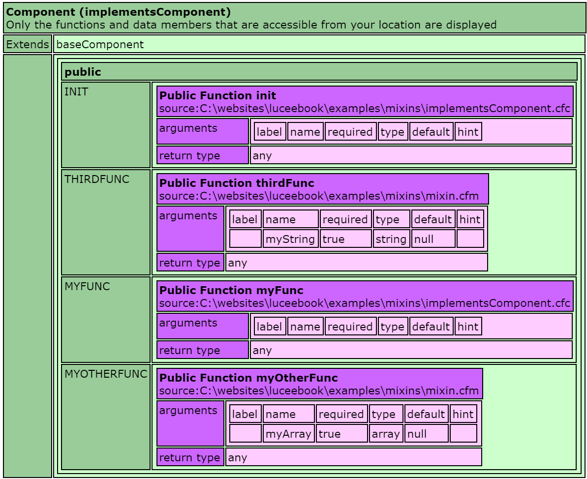
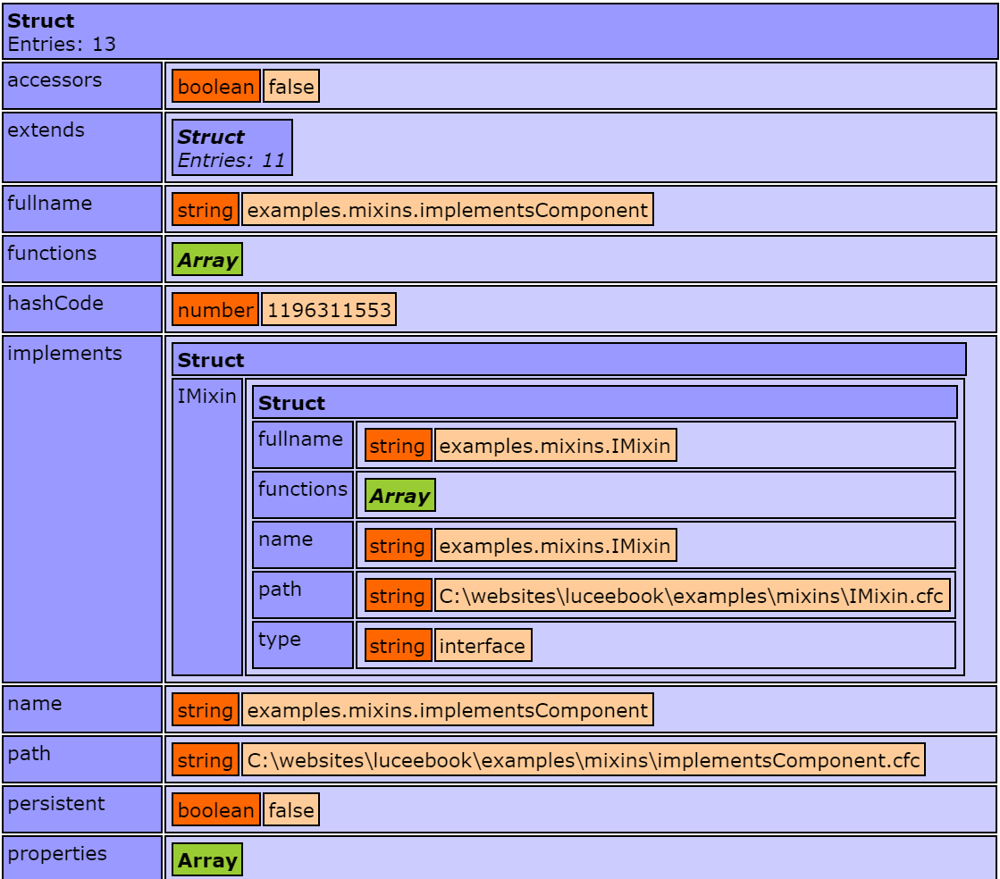

# Mixins
[Mixins](https://en.wikipedia.org/wiki/Mixin) are a programming feature which allow for dynamically adding methods to components during instantiation. Lucee support both [type checked mixins](type-checked-interface-mixins) conforming to an interface, and unchecked [dynamic mixins](dynamic-mixins).

##Mixin Rationalle 

Mixins are used when a component has "cross cutting" functionality that is shared with other components, and which this functionality should be exposed as functionality of the component itself. This allows for code reuse by only writing the functionality in one place, and then including it in other places.

In terms of code-reuse, this allows for more flexibility than inheritance because multiple sets of functionality can be 'mixed in', and it is less boilerplate than creating ['Decorator' classes](https://en.wikipedia.org/wiki/Decorator_pattern) which simply wrap other function calls.

Lucee's mixin capability with interfaces can be used to approximate a [Trait](https://en.wikipedia.org/wiki/Trait_(computer_programming)

##Dynamic Mixins
There are two methods of acheiving mixins with Lucee:
1. [Including Functions](#including-functions)
2. [Lifting, or copying functions between components](#lifting--copying-functions)

###Including Functions

Consider this basic component without any mixins:



<noscript>
```
component {
  
  function init(){
    //Do something on instantiation 
    return this;
  }  

}
```
</noscript>

If we dump this component it looks like:


If there was functionality that we wanted to share amongst this component and other components and did not want to write wrapper functions, we can make use of the `include` statement to include functions into this component. Consider this set of functions:



<noscript>
```
<cfscript>
function myOtherFunc(required array myArray){

}

function thirdFunc(required string myString){
	
}
</cfscript>
```
</noscript>

Notice that these functions are written in a .cfm file, a template file. This is important, because when we 'include' these functions, Lucee can only include template files. To see how to mixin functions which are from other components, read the Lift/Copying method further along in this article.

To mixin this function file, we need to include it in the implicit constructor area of a component:



<noscript>
```
component {

  include template="mixin.cfm";
  
  function init(){
    //Do something on instantiation 
    return this;
  }  

}
```
</noscript>

If we dump the component, it looks like this and we see the additional functions:


###Lifting & Copying Functions
The include method described above assumes that the functions to mixin are in a .cfm template. However, what if the function are a part of an existing component that can be used independently, but which you also want to mixin that functionality into another component? To achieve this, we make use of the fact that in Lucee, [functions are first class citizens](https://rorylaitila.gitbooks.io/lucee/content/first_class_functions.html)

Consider this additional component:



<noscript>
```
component {

	function fourthFunc(){

	}

	function fifthFunc(){
		
	}

}
```
</noscript>

Because this is a component, it can be used directly like any component. However we can also use these fourthFunc() and fifthFunc() functions in our basic component by copying them in.



<noscript>
```
component {

  mixinComponent = new mixinComponent();
  this.fourthFunc = mixinComponent.fourthFunc;
  variables.fourthFunc = mixinComponent.fourthFunc;

  this.fifthFunc = mixinComponent.fifthFunc;
  variables.fifthFunc = mixinComponent.fifthFunc;
  
  function init(){
    //Do something on instantiation     
    return this;
  }  

}
```
</noscript>

This is a bit more involed, so we'll explain in steps:

First we instantiated the component that we wished to mixin:

`mixinComponent = new mixinComponent();`

Then we copied each of the functions we wish to use into the `this` scope and `variables` scope. It is important to copy into both scopes because "this" is available outside the component, and variables from within. If not copied into both scopes, then Lucee will not be able to find the functions from within the component.

```
this.fourthFunc = mixinComponent.fourthFunc;
variables.fourthFunc = mixinComponent.fourthFunc;

this.fifthFunc = mixinComponent.fifthFunc;
variables.fifthFunc = mixinComponent.fifthFunc;
```

By doing this, now when we dump the basic component with these copied in functions, it looks like this:


This method of copying functions is a little more verbose, and each function that needs to be used must be explicity copied. But it can be a useful alternative when just one or two functions need to be copied from another component.

##Type Checked Interface Mixins
[Lucee Interfaces](https://rorylaitila.gitbooks.io/lucee/content/interfaces.html) are type checked during instantiation of a component and ensure that the component implements a set of methods. However, this interface type checking happens before executing the implicit constructor area where the mixins were included or lifted. To ensure that a component mixing in functions can `implement` an interface matching those mixins, we need to make use of component inheritence. 

This is achieved by moving our mixins to a base component, inheriting that component, and then implementing the interfaces on the final component. 

Consider these functions we wish to mixin:



<noscript>
```
<cfscript>
function myOtherFunc(required array myArray){

}

function thirdFunc(required string myString){
	
}
</cfscript>
```
</noscript>

And consider this Interface that we created to type check this particular set of mixed-in functions:



<noscript>
```
interface {
  
  public function myOtherFunc(required array myArray){
  
  }

  public function thirdFunc(required string myString){
  
  }

}
```
</noscript>

To use this interface with these mixins, we are first going to create a base component that mixes in the functions:



<noscript>
```
component {
	include template="mixin.cfm";
}
```
</noscript>

Then our component which we want to conform to the interface, implements this base class:



<noscript>
```
component extends="baseComponent" implements="IMixin"{
  
  function init(){
    //Do something on instantiation 
    return this;
  }

  function myFunc(){

  }  

}
```
</noscript>

If we dump this component, we see the following method signatures:



And if we use getMetaData on this component, we see it implements the following interfaces:



####Inheritence Execution Order
The reason this above method works is because Lucee Interface type checking and component initialization happen in the following order: 

1. The component meta data is read but the component is not initialized
2. Any components that the component extends are initialized first (going through the whole extends hierarchy)
3. Lucee then checks the `implements` attribute of the original component and ensures that the component, or any component it extends, contains the function signatures.
4. Lucee finishes initializing the component, calling the implicit constructor area

This inheritence mixin method will work with both include and copy style mixins.