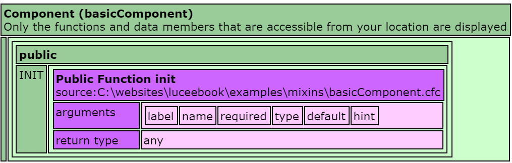
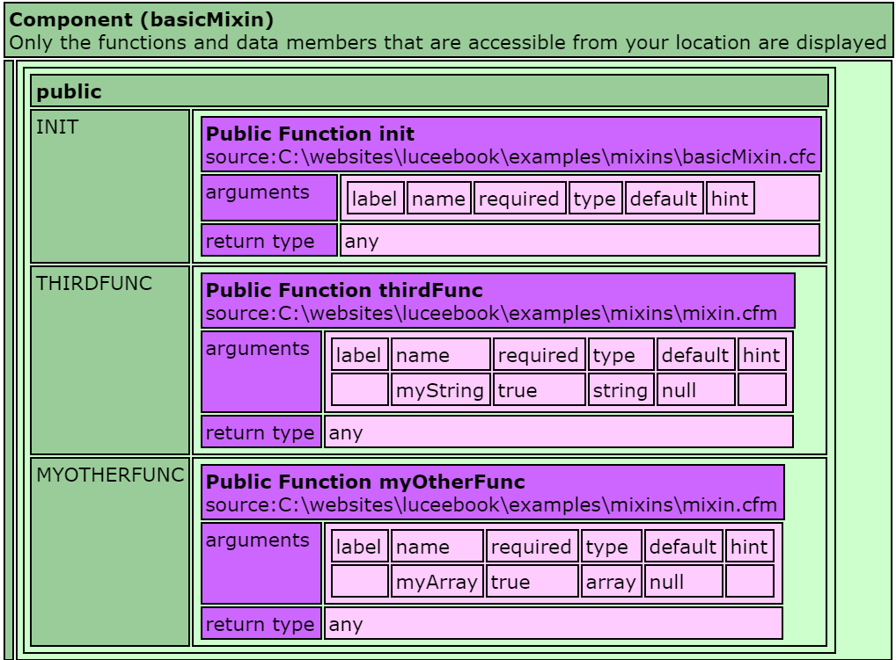

# Mixins
Mixins are a programming feature which allow for dynamically adding methods to components during instantiation. Lucee support both type checked mixins confirming to an interface, and unchecked dynamic mixins.

Mixins are used when a component has "cross cutting" functionality that is shared with other components, and which this functionality should be exposed as functionality of the component itself. This allows for code reuse by only writing the functionality in one place, and then including it in other places.

In terms of code-reuse, this allows for more flexibility than inheritance because multiple sets of functionality can be 'mixed in', and it is less boilerplate than creating ['Decorator' classes](https://en.wikipedia.org/wiki/Decorator_pattern) which simply wrap other function calls.

##Dynamic Mixins
There are two methods of acheiving mixins with Lucee:
1. Including Functions
2. Lifting, or copying functions between components

###Including Functions

Consider this basic component without any mixins:



<noscript>
```
component {
  
  function init(){
    //Do something on instantiation 
    return this;
  }  

}
```
</noscript>

If we dump this component it looks like:



If there was functionality that we wanted to share amongst this component and other components and did not want to write wrapper functions, we can make use of the `include` statement to include functions into this component. Consider this set of functions:



<noscript>
```
<cfscript>
function myOtherFunc(required array myArray){

}

function thirdFunc(required string myString){
	
}
</cfscript>
```
</noscript>

Notice that these functions are written in a .cfm file, a template file. This is important, because when we 'include' these functions, Lucee can only include template files. To see how to mixin functions which are from other components, read the Lift/Copying method further along in this article.

To mixin this function file, we need to include it in the implicit constructor area of a component:



<noscript>
```
component {

  include template="mixin.cfm";
  
  function init(){
    //Do something on instantiation 
    return this;
  }  

}
```
</noscript>

If we dump the component, it looks like this and we see the additional functions:



###Lifting & Copying Functions
The include method assumes that the functions to mixin are in a .cfm template. However, what if the function are a part of an existing component that can be used independently, but which you also want to mixin that functionality into another component? To achieve this, we make use of the fact that in Lucee, [functions are first class citizens](https://rorylaitila.gitbooks.io/lucee/content/first_class_functions.html)

Consider this additional component:



<noscript>
```
component {

	function fourthFunc(){

	}

	function fifthFunc(){
		
	}

}
```
</noscript>

Because this is a component, it can be used directly like any component. However we can also use these fourthFunc() and fifthFunc() functions in our basic component by copying them in.



<noscript>
```
component {

  mixinComponent = new mixinComponent();
  this.fourthFunc = mixinComponent.fourthFunc;
  variables.fourthFunc = mixinComponent.fourthFunc;

  this.fifthFunc = mixinComponent.fifthFunc;
  variables.fifthFunc = mixinComponent.fifthFunc;
  
  function init(){
    //Do something on instantiation     
    return this;
  }  

}
```
</noscript>


##Type Checked
