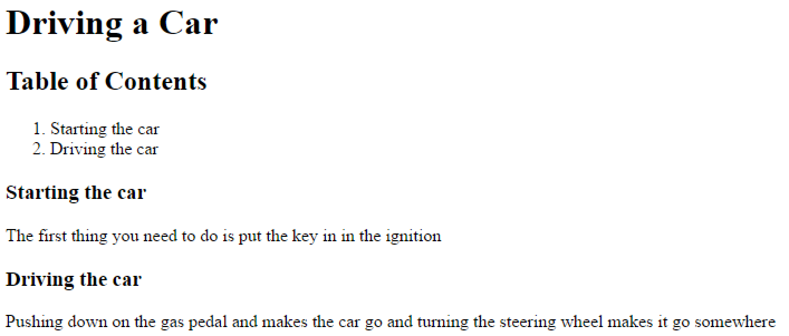

# Nested Custom Tags

In the previous article [Creating Custom Tags](https://rorylaitila.gitbooks.io/lucee/content/creating_custom_tags.html), it used an example of a single tag. Single use tags can be powerful but even moreso, Lucee can nest custom tags which can communicate with eachother and enabled complex behavior.

Consider this view template which generates an article and a Table of Contents for each section. It has a `<cf_article>` tag which contains multiple `<cf_section>` tags. And these two tags will worth together to produce the output.



Although there is nothing in the markup that produces a table of contents, when the script executes, a table of contents is produced by the custom tags:



What makes nested custom tags powerful is it can enable writing complex view code which can take a few tags and options, but generate complex output.

##How Nested Tags Work
Because custom tags are simply .CFC components, they can do anything a Component can do. But in order for a nested tag to be aware of its parent, Lucee tells nested tags who their parents are.

Lets start with the implementation of the nested tag `<cf_section>`: 



The new feature of this section tag that was not used in any previous examples is the `init()` function. Focus on just the function signature to start:

```
public void function init(component parent, required boolean hasEndTag){
    //ommitted 
}
```

When Lucee encounters a custom tag and instantiates it, it will pass two parameters to the init() function, first is a reference to the parent cfc, and second a true/false for `hasEndTag`. Notice that hasEndTag is required, but parent is not. This means that a parent is not always present. If a custom tag does not have any parent tags (which the `<cf_article>` in the example is the root tag thus does not have any parents) then this value will be null.

Looking at the full implementation: 

```
public void function init(component parent, required boolean hasEndTag){
    if(!isNull(parent)){
        parent.addChild(this);
    } else {
        throw("Cannot have sections without a parent <cf_article>");
    }
}
```

We see that it does two things: First, it checks if the parent exists, and then calls `parent.addChild(this)` (more on this later), or else it throws an error that sections must have a parent article.

Moving on to the `<cf_section>` onEndTag() function, it is implemented: 

```
public boolean function onEndTag(required struct attributes, required struct caller, string generatedContent){
      param name="attributes.title";
      variables.title = attributes.title;
      variables.body = generatedContent;
      return false;
  }
```

Instead of outputting the tag content or title, instead it is setting the content into the variables scope. This is for later use by the `<cf_article>` parent. Also see that `<cf_section>` implements two getter methods for variables.title and variables.body:

```
public function getTitle(){
    return variables.title;
}

public function getBody(){
    return variables.body;
}
```

The purpose of these getter methods is so that `<cf_article>` can get to the data of `<cf_section>`. Now that we have the implementation of `<cf_section>`, lets see the implementation of `<cf_article>`:



The first thing to point out is the implicit constructor area has this variable being set: 

```
this.children = [];
```

This array will be used to hold references to all of the child `<cf_section>` tags.

Next there is a function `addChild()`:

```
public function addChild(required component child){
    this.children.append(child);
}	
```

We see that this function takes a component and adds that component to the array of children. Recall from the `<cf_section>` implementation, it called the addChild() function in its own constructor:

>section.cfc
```
public void function init(component parent, required boolean hasEndTag){
    if(!isNull(parent)){
        parent.addChild(this);
    } else {
        throw("Cannot have sections without a parent <cf_article>");
    }
}
```

This interaction above, of the Parent (`<cf_article>`) exposing a function that the child (`<cf_section>`) can call, is the primary means by which parent and nested tags can become aware of each other. Now that the tags have been linked, `<cf_article>` can implement the functionality to control the output of all of the tags together, via the onEndTag() function:

```
public boolean function onEndTag(required struct attributes, required struct caller, string generatedContent){

    param name="attributes.title";
    echo("<h1>#attributes.title#</h1>");


    if(this.children.len() == 0){
        echo("<p>There are no sections yet</p>")
    } else {

        echo("<h2>Table of Contents</h2>");
        echo("<ol>");

        for(var child in this.children){
            echo("<li>#child.getTitle()#</li>");
        }

        echo("</ol>");

    }

    for(var child in this.children){
        echo("<h3>#child.getTitle()#</h3>");
        echo("<p>#child.getBody()#</p>");
    }

    return false;
}
```

What the implementation here does is check if there are any children sections, if there are, it outputs a table of contents. It then outputs the title and content for each section. Notice these function calls in particular:

```
echo("<h3>#child.getTitle()#</h3>");
echo("<p>#child.getBody()#</p>");
```

Because the `<cf_section>` added itself as a reference inside the parent `<cf_article>`, the parent now has a reference to the child. And it can call the public getter methods `getTitle()` and `getBody()` to produce the desired output.

With this basic method of linking the parent>child tags together via references, and then exposing public methods on them to get to each others data, virtually any complex interaction and output is possible. 


