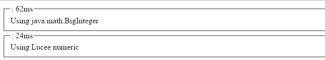

# Numeric (DRFAT)
Lucee has a built in number type called Numeric. This type supports numbers with up to 16 digits of precision. Lucee will use [type coercion](https://rorylaitila.gitbooks.io/lucee/content/types.html#type-coercion) and automatically convert numeric types to string and visa versa, depending on use.  

##Creating a Number
Creating a number in Lucee is accomplished by setting a number to a variable:



When dumping the variable, it will be of the numeric type:

##Using a Number
Any variable which is numeric can be used with [mathematical operators](https://gist.github.com/roryl/6edb0b617f29447556e515e4b7597281) (addition, subtraction, etc). 



##Numeric Type Coercion
Lucee will also automatically convert strings to numbers when they are used in mathematical operations. In this example, a Lucee string is created by enclosing the number in quotes:



In the dump of the variable it is a string type and not a numeric type:

However, if this string is used in mathematical operations, Lucee will try to convert it to a numeric and will return a numeric type after the operation:



If Lucee cannot convert a string to a valid number, it will throw an error like `can't cast string to a number value` as in this example:



##Working with Big Integers
Numbers in Lucee are a floating point number with 16 digits of precision (Lucee uses the java.lang.Double type). For most use cases, this is a sufficiently performant way for Lucee to store numbers. However for really big integers (greater than 16 digits), this will cause Lucee to approximate or round the remaining values. 

Consider this number with 18 digits `135837265748372615`, if used in Lucee and dumped, the resulting number will not match:



Once Lucee has created the number and it is dumped, it is different:

We see here that the original number set into the variable was `135837265748372615`, but the resulting number was `135837265748372608`. Only the first 16 digits between the numbers were preserved exactly.

There are two corrective measures if you need to use big integers:

1. Store Big Integers as Strings
2. Use the java.math.BigInteger class

###Store Big Numbers as Strings
If the number only needs to be passed around, saved and/or output and *does not* need any math applied to it, the number can be stored as a string to preserve its value:



If the value is dumped it will be as type string:

**Any math operators applied to this string will change it back into a numeric type and lose precision **

###Use the java.math.BigInteger class
The underlying Java class BigInteger is designed to work with integers of infinite length. Lucee numbers can be converted into BigIntegers.

>Note: When using BigInteger, all work must be performed using the BigInteger class. Using any Lucee operators or functions on the BigInteger will work, but they will convert the number back into a Lucee numeric, which may loose precision.

###Creating a BigInteger

To create a BigInteger, use the javaCast method to convert a string into a BigInteger.



To dump the value, we needed to call `toString()` on the BigInteger, otherwise Lucee would have converted it back to Numeric when dumping and have lost the precision.

> Note: Converting a Lucee Numeric into a BigInteger will not work:  `javaCast("java.math.BigInteger", 135837265748372615)` Notice that the number is not in quotes (a string), therefore Lucee creates a numeric out of it. The numeric type is created before being passed to javaCast, and so it lost precision before even starting.

If creating a lot of BigIntegers in code, there is another method which may be shorter syntax: 



###Working with BigInteger
The primary thing to keep in mind is that when working with the BigInteger objects, any numbers being operated on must also be BigIntegers. Any conversion to Lucee numeric type explicitly or implicity (by performing a native +, -, / etc) will loose the precision.

The BigInteger class has functions like add(), subtract(), divide() and pow() [multiply]. Use these functions to perform math operations on BigIntegers. The full list of BigInteger functions can be found at the [java.math.BigInteger documentation](https://docs.oracle.com/javase/7/docs/api/java/math/BigInteger.html).

Here is an example of adding two big integers together:



which results in:

###BigInteger performance
There is a 2-3x performance penality for using BigInteger. Consider this example which does 100,000 additions of two numbers, using BigInteger, vs the Lucee numeric:

 

The BigInteger example takes about 3 times longer to execute. Although this is not likely to be a problem for most systems this is something to consider. You can make use of BigInteger only in the portions of your application where it is expected. In most cases, the Lucee numeric type will be sufficient.

<noscript>
##Big Integers and SQL
When Lucee encounters a Big Integer value from a SQL database, it will convert it to a string. Databases may often use Big Integers for primary or unique identifiers. It is important to be aware that any math operators on this value will convert it to a Lucee numeric and loose precision.
</noscript>