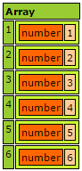
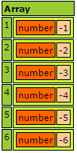

# Parallel Functions
The easiest way to get started with concurrency in Lucee is with the available parallel functions map(), each(), every(), reduce(), some(), filter(), map(). These functions operate on structs, arrays and query objects. Each function has specific use cases, but this article will focus on using each() and map() for concurrency. 

##A Basic Each Example
Consider the following example which uses the map() function to flip some numbers from positive to negative. 



The starting array with the numbers looks like this:




<noscript>
```
<cfscript>
myArray = [1,2,3,4,5,6];
writeDump(myArray);
flipped = myArray.map(function(value){
	return value * -1;
});
writeDump(flipped);
</cfscript>
```
</noscript>

This example started with an array of numbers, and then calls the map() method on the array. map() will iterate through each array element and then return a new array with the results of the closure that was called on each array element. It then dumps the result of `flipped` which looks like:



This basic example of map() is fairly straight forward. The unique feature of Lucee is its ability to concurrently run map which is described below.

##Running map in parallel
With only 6 numbers in the above example, flipping the numbers negative completes almost instantly. But what if there was a lot of data, say hundreds of numbers, and the computation of each number took a long time. Lucee can speed up execution by running map() in parallel. 

Consider this expanded example which has 100 numbers:



<noscript>
```
<cfscript>
myArray = []
loop from="1" to="100" index="i"{
	myArray.append(randRange(1,10));
}

timer type="inline"{
	flipped = myArray.map(function(value){
		sleep(100);
		return value * -1;
	});	
}
</cfscript>
```
</noscript>

In this example, it also mimics a slow computation by forcing each flip to take an extra 100 miliseconds with the `sleep()` function. 

Executing this script to flip 100 numbers from positive to negative takes about 10,000 milliseconds (10 seconds). This can be sped up considerably by telling Lucee to run the map in parallel:



<noscript>
```
<cfscript>
myArray = []
loop from="1" to="100" index="i"{
	myArray.append(randRange(1,10));
}

timer type="inline"{
	flipped = myArray.map(function(value){
		sleep(100);
		return value * -1;
	}, true, 2);	
}
</cfscript>
```
</noscript>

The change here is to set parrallel to true, and maxThreads to 2

```
myArray.map(function(value){
    sleep(100);
    return value * -1;
}, true, 2);
```

When this executes, it will now execute in half the time, at only 5 seconds. If the number of threads is set to 4, it will execute in about 2.5 seconds:

```
myArray.map(function(value){
    sleep(100);
    return value * -1;
}, true, 4);
```

###Considerations
Not every workload can be parallelized efficiently. There is a startup cost to each thread that Lucee creates, and therefore the time it takes to execute each iteration must be greater than the time it takes to create the thread. Otherwise it will actually be slower to execute in parallel! In testing, Lucee seems to take 5-10ms to create a thread. 

Another thing to consider is the number of max threads. The most efficient number of threads is likely to be equal to the number of CPU cores available on the machine, and there is a limit to the number of threads that the JVM can efficiently manage. So don't simply set a very high number of max threads. It is better to start small, say 2 max threads, and increase until it is no longer beneficial. 


