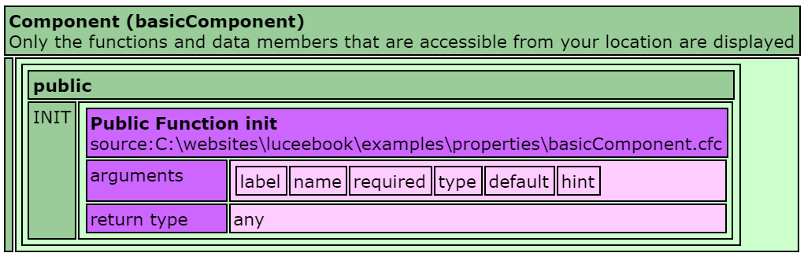
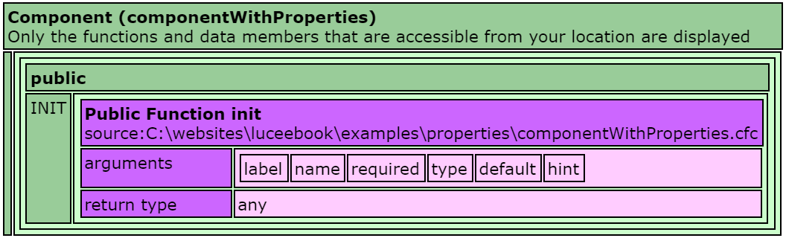
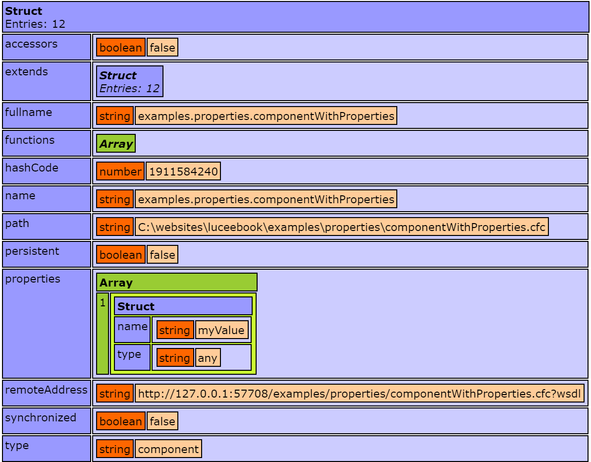

# Properties
Properties in Lucee allow annotating Components with meta data about fields in the component. Properties are most used when creating persistent Entities with the ORM, but they can also be used with POLO (Plain Old Lucee Objects).

- [Basic Example](#basic-example)
- [Lucee Generated Accessors](#lucee-generated-accessors)

##Basic Example
By default, properties do not change any behavior of the class and simply allow for meta data reflection. Consider this basic Component without any properties: 



<noscript>
```
component {
  
  public function init(){
  }
  
}
```
</noscript>

If we dump this component, it looks like:



And consider this component with a property:



<noscript>
```
component {
  
	property name='myValue';

	public function init(){
		return this;
	}
  
}
```
</noscript>

If we dump this component, it looks like the following:



You can see here that the components are nearly identical, the additional 'property' defined in the componentWithProperties.cfc did not change any behavior about the class. But if we look at the meta data using the reflection function `getComponentMetaData()`, our property appears under the 'properties' section:






Any attributes given to the property will appear in this meta data, and this functionality is often used by open source frameworks to dynamically read components and work with it. For example, the [Wirebox Dependency Injection](http://wiki.coldbox.org/wiki/WireBox.cfm) framework uses properties to determine how to configure components using the framework.

This meta data in of itself is not too interesting for most cases, but properties become more powerful with Lucee Generated Accessors.

Properties are also heavily used for the Lucee ORM. See that documentation for details. The rest of this article will focus on the Generated Method functionality that Lucee provides.

##Lucee Generated Accessors