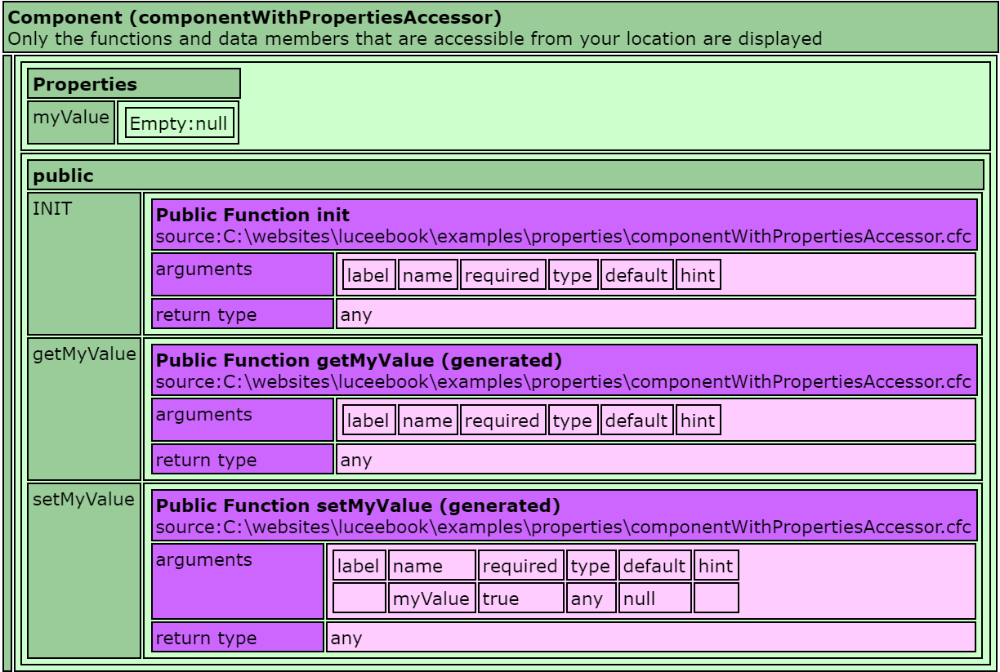
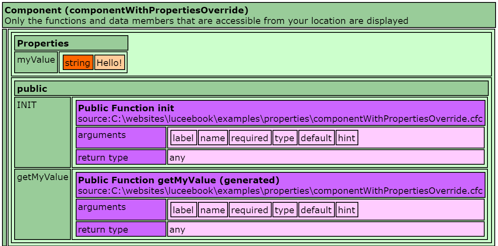

# Properties
Properties in Lucee allow annotating Components with meta data about fields in the component. Properties are most used when creating persistent Entities with the ORM, but they can also be used with POLO (Plain Old Lucee Objects).

- [Basic Example](#basic-example)
- [Lucee Generated Accessors](#lucee-generated-accessors)
  - Overriding Getter & Setter

##Basic Example
By default, properties do not change any behavior of the class and simply allow for meta data reflection. Consider this basic Component without any properties: 



<noscript>
```
component {
  
  public function init(){
  }
  
}
```
</noscript>

If we dump this component, it looks like:


And consider this component with a property:



<noscript>
```
component {
  
	property name='myValue';

	public function init(){
		return this;
	}
  
}
```
</noscript>

If we dump this component, it looks like the following:


You can see here that the components are nearly identical, the additional 'property' defined in the componentWithProperties.cfc did not change any behavior about the class. But if we look at the meta data using the reflection function `getComponentMetaData()`, our property appears under the 'properties' section:




Any attributes given to the property will appear in this meta data, and this functionality is often used by open source frameworks to dynamically read components and work with it. For example, the [Wirebox Dependency Injection](http://wiki.coldbox.org/wiki/WireBox.cfm) framework uses properties to determine how to configure components using the framework.

This meta data in of itself is not too interesting for most cases, but properties become more powerful with Lucee Generated Accessors.

Properties are also heavily used for the Lucee ORM. See the Lucee ORM documentation for details. The rest of this article will focus on the Generated Method functionality that Lucee provides.

##Lucee Generated Accessors
Lucee can use properties defined in a component to auto-generate getter and setter methods, set default values, and type check and validate the values. This is very handy for components with a lot of fields, as creating accessors to those fields is a lot of boilerplate code. 

Taking the componentWithProperties.cfc example above, all that is required to tell Lucee to use generated accessors is to add `accessors=true` to the component:



<noscript>
```
component accessors='true' {
  
	property name='myValue';

	public function init(){
		return this;
	}
  
}
```
</noscript>

Now when we dump this component, we see that it has a property:



And for comparison, here was the image of the componentWithProperties.cfc that did not have `accessors=true`


Notice two changes: 
- There is now a 'properties' data value in the component
- There are two new functions, `getMyValue` and `setMyValue`, Lucee created these automatically.

For each property, Lucee will generate a getter and a setter function.

With these functions generated, it is now possible to set and retrieve values into the component:



<noscript>
```
<cfscript>
myComponent = new componentWithPropertiesAccessor();
myComponent.setMyValue("Hello!");
echo(myComponent.getMyValue());
</cfscript>
```
</noscript>

This example above merely outputs `Hello!`

###Overriding Getter & Setter
If a particular property should not have a getter or a setter, tell Lucee to not generate it by setting `getter=false` or `setter=false` for that particular property. This is most often used to disable setters in which the value is handled by the internals of the component.

Consider the following component where we disable the setter and set the `myValue` variable within the constructor:



<noscript>
```
component accessors='true' {
  
	property name='myValue' setter='false';

	public function init(){
		variables.myValue = 'Hello!';
		return this;
	}
  
}
```
</noscript>

When we dump the component, it now looks like this, with the primary difference being that there is no `setMyValue` function, and we see that the property is populated with the value that was set in the constructor:



In this example below, it tries to use the `setMyValue()` function but it will throw an error (`component [componentWithPropertiesOverride] has no function with name [setMyValue]`), which is expected, because this function was not generated by Lucee.



<noscript>
```
<cfscript>
myComponent = new componentWithPropertiesOverride();
writeDump(myComponent);
echo(myComponent.getMyValue());
myComponent.setMyValue("Hello!"); //errors that function does not exist
</cfscript>
```
</noscript>

###Setting a Default Value
When using accessors, Lucee can also set the default value on component creation. Consider the following component with a default property:



<noscript>
```
component accessors='true' {
  
	property name='myValue' default='test this is a default!';

	public function init(){
		return this;
	}
  
}
```
</noscript>

When dumping this component it now looks like:


And the script to create use component :



<noscript>
```
<cfscript>
myComponent = new componentWithPropertiesDefault();
writeDump(myComponent);
echo(myComponent.getMyValue());
</cfscript>
```
</noscript>


