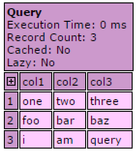
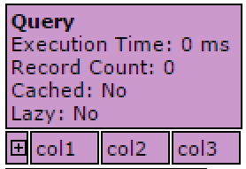
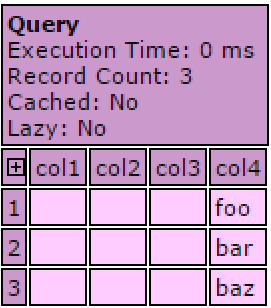
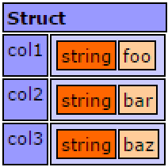
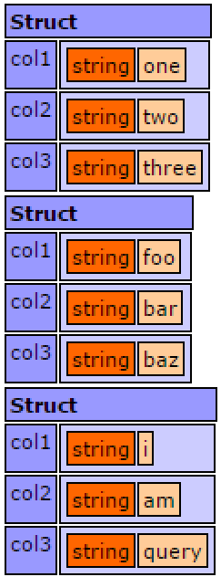

# Queries

This article deals with working with existing query objects (recordsets). To see how to make SQL statments in Lucee, see the article on [SQL Persistence](https://rorylaitila.gitbooks.io/lucee/content/sqlrdbms.html)

Query objects in Lucee are a powerful type of object that acts a bit like an array, and a bit like a structure. It is the data type that Lucee returns SQL record sets into, and is also useful as a data structure for non SQL operations. Lucee Query objects are created from SQL statements, the ORM, Other Query objects, Directory functions, HTTP requests, and more. 

Query objects conceptually look and act like a database table, like a spreadsheet. They have columns and rows.

In these examples, they will use a Query object created manually.

##Creating a Query Object
Query objects can be created on the fly as we do in these examples. Below is a basic query with three columns and three rows



When dumping this query in the example, it looks like this:

>Dump of myQuery
>

Its also possible to create a query with no data



>Dump of an empty myQuery
>
>

##Adding new Rows
New rows can be appended onto the ends of query objects. The addRow() function takes data, as in this example, or it can be empty in which case it appends an empty row.



>myquery dump
>

This dump above shows a new row being added to the empty query this example created

##Adding New Columns
With any existing query object, new columns can be added and populated with data:



> myQuery Dump
> 
> 

In this dump we see that an additional column was added, but it also filled in the rows of previous columns which did not have any data. All of the query functions keep all of the columns & rows in sync.

##Retreiving Query data by Column

To get all of the data from a particular column out of a query, use the `columnData()` function



>Dump of columnData()
>
>

##Looping over Queries
There are a few methods to loop over queries depending on what meta needed within the loop.

###For Row in Query
This method loops over each row in the query



The for [row] in [query] syntax returns the row data for each iteration of the loop, in a structure format. 

>Since this example loops over three rows, it made three dumps, one for each row
>
>

This method is very clean and straight forward when the intention is to loop over all rows, the only downside is the loop body does not have access to the index, and it can't constrain to a maximum number of rows (without using `break;` to exit the loop). It also can't skip rows (for example, return every 5th record). The next looping style can do these things. 

###Looping with the Recordcount & ID
It's possible to loop over a query and obtain a reference to the row number, by doing a traditional loop with the `recordCount()` function that the query object exposes



The difference with this loop, is there is no implicit reference to the whole row. The loop body has access to the myQuery object, and the index ("i" in this case). Thus the column & row data is accessed in the format `queryObject.columnName[index]`

Though this looping mechanism would allow limiting the total number of rows, or skipping rows

###Loop

The loop tag is another method of looping over query objects and works a little differently from the preceeding two examples. 



With the loop tag, the tag body has variable which references the column of the particular row the loop is currently on. Thus by the `echo(col1)` that is implicitly returning the value from col1 for the current row of the loop. 

The loop tag has additional attribtes that can be used to control the iterations:

* maxrows - Will set the maximum number of rows to loop over
* startrow - Will set the row at which the loop should start
* endrow - Will set the row at which the loop should end



The example above which has 6 rows, but the  `startrow=2` and `maxrows=2` are set, and so it only outputs those two rows.

>foo | bar | baz | 
>
>ford | chevy | kia | 
