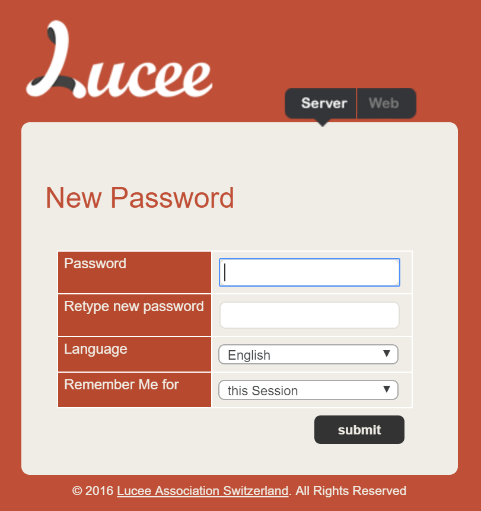
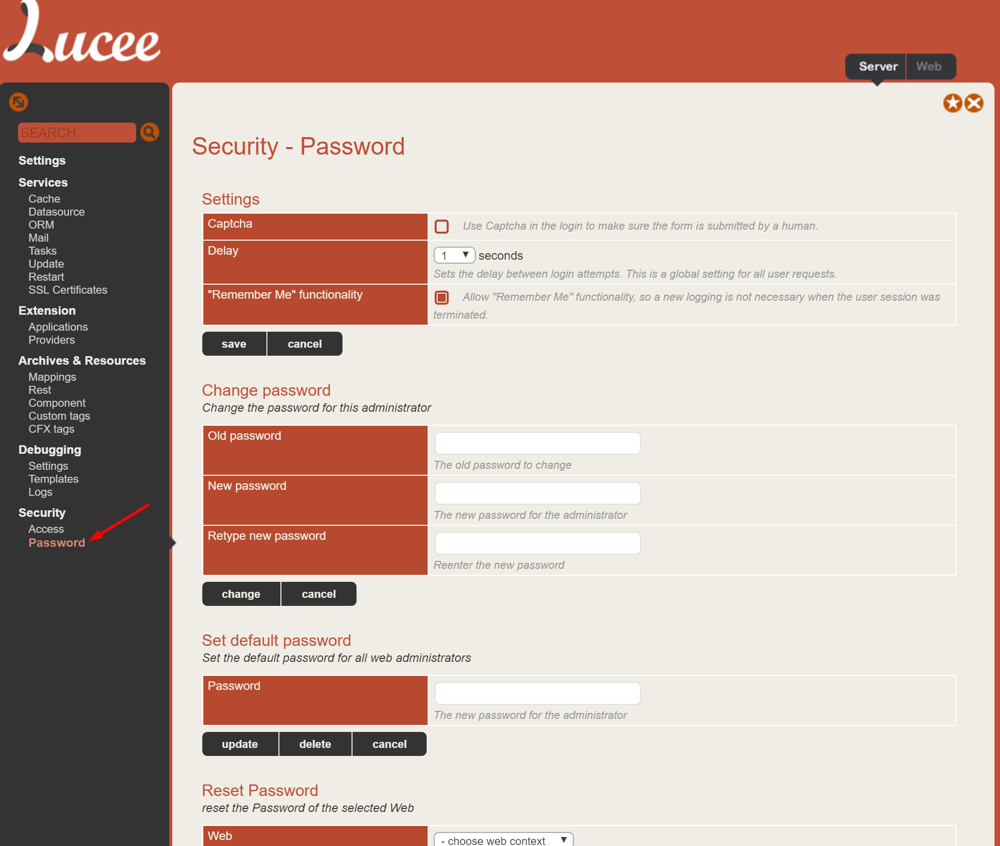

# Resetting Admin Passwords

It is possible to reset both the Lucee Server Admin password (/lucee/admin/server.cfm) and each web context password (/lucee/admin/web.cfm).

##Resetting A Lost Server Admin Password
In order to reset a lost server admin password, you'll need root access to the machine with the Lucee installation.

1. Locate the Lucee server context configuration file
  2. On a Linux tomcat installation, it is located: `/opt/lucee/lib/lucee-server/context/lucee-server.xml`
  3. On Windows CommandBox it is located: `C:\Users\{YOUR USER}\.CommandBox\engine\cfml\server\lucee-server\context`
3. Locate the line that looks like this: `<cfLuceeConfiguration hspw="08ff01745878248e85425ea046533aa72e5595975c4f40ce85e1bae0ee9619b7" salt="505516A5-3EF1-4F43-8F0B7E0C2336CC91" version="4.5">`
4. Delete the attributes hspw & salt and save the file so that this line looks like this: `<cfLuceeConfiguration version="4.5">`
5. Restart the Lucee Server
6. Go to the Server Admin and set a new password `/lucee/admin/server.cfm'

##Resetting Server and Web Context Passwords from the Admin
With access to the server admin (see the section above if you have lost your password), the password for the server admin each web admin can be reset if need be. To do so:

1. log into the server admin /lucee/admin/server
2. Go to Security > Password in the menu

The following features are available on this page:

1. **Change Password**: This will change the password for the server admin
2. **Set Default Password**: This will set the default password that all web administrators start with. This is important to set if auto deploying domain names to your system, as without it, passwords can be set by any user that goes to the admin.
3. **Reset Password**: Select the webcontext to change and then the next time the web context admin is accessed, it will prompt for a new password.

###Admin Security Settings Screenshot
