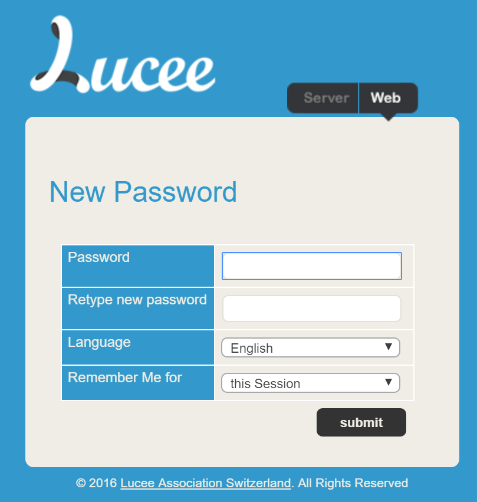

# Resetting Admin Password

It is possible to reset both the Lucee Server Admin password (/lucee/admin/server.cfm) and each web context password (/lucee/admin/web.cfm).

##Resetting Lost Server Admin Password
In order to reset a lost server admin password, you'll need root access to the machine with the Lucee installation.

1. Locate the Lucee server context configuration file
  2. On a Linux tomcat installation, it is located: /opt/lucee/lib/lucee-server/context/lucee-server.xml

##Resetting Web Admin
With access to the server admin, the password for each web admin can be reset if need be. To do so:

1. log into the server admin /lucee/admin/server
2. Go to Security > Password in the menu
3. At the bottom is the "Reset Password" section. Select the webcontext to change and then the next time the web context admin is accessed, it will prompt for a new password.

