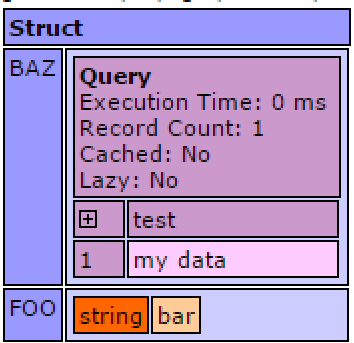
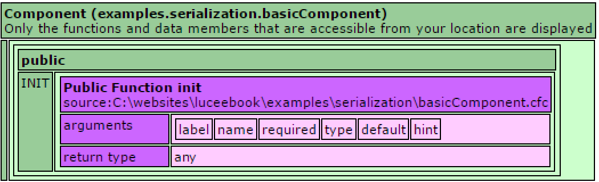
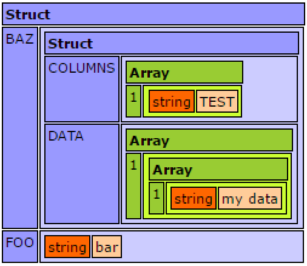

# Serialization

Serialization allows turning any complex objects (Components, Arrays, Structs, Queries) into a string representation that can be transferred or stored. The two common scenarios for serialization are 1) Persisting complex Lucee objects to a database or file system, or transfering them between systems, and 2) Turning objects into Json for an API or client use.

* [Persisting & Transferring Complex Objects](#persisting-transfering-complex-objects)
* [Serializing to Json](#serializing-to-json)

##Persisting & Transferring Complex Objects
There are sometimes use cases for saving objects to persistent storage directly, and loading them back, without saving the object's data into a structured data store like a SQL database. There are also times when say a Component might want to be transfered between systems, but creating a formal API is overkill. As long as the system both writing and reading the serialized objects is Lucee, any object in Lucee can be saved and recreated.

> To serialize (turn it into text) any Lucee object, use the `serialize()` function

> To deserialize (get back a real object) any Lucee object, use the `evaluate()` function

###Serialization Example
This example serializes a simple struct that has a query nested inside of it.



<noscript>
```
<cfscript>
<cfscript>
myStruct = {foo:"bar", baz:queryNew("test","varchar",[{test:"my data"}])};
structText = serialize(myStruct);
echo(structText);
</cfscript>
```
</noscript>

The output of the echo is:

`{'BAZ':query('test':['my data']),'FOO':'bar'}`

When Lucee serializes complex objects, notice how it is very similar to Json, but there are differences. For exmaple, the query is turned into a function `query()` which when deserialized, will create the query again. This is something not possible in Json.

To deserialize that string above and get the structure back, use the `evaluate()` function:



<noscript>
```
<cfscript>
structText = "{'BAZ':query('test':['my data']),'FOO':'bar'}";
myStruct = evaluate(structText);
writeDump(myStruct);
</cfscript>
```
</noscript>

Which the above example outputs:




Here is an example of serializing a Component:

First, a basic component:



<noscript>
```
component {
  this.foo = "bar";
  function init(){
    //Do something on instantiation 
    return this;
  }
}
```
</noscript>

Then serialize the component:



<noscript>
```
<cfscript>
myComponent = new basicComponent();
componentText = serialize(myComponent);
echo(componentText);
</cfscript>
```
</noscript>

It results in the output:

`evaluateComponent('examples.serialization.basicComponent','c31d231165a410c67a9a8c57da575e88',{'FOO':'bar'},{})`

Which this can be deserialized back into the original component:



<noscript>
```
<cfscript>
componentText = "evaluateComponent('examples.serialization.basicComponent','c31d231165a410c67a9a8c57da575e88',{},{})";
myComponent = evaluate(componentText);
writeDump(myComponent);
</cfscript>
```
</noscript>

Which the output looks like:




## Serializing to JSON

When building web services or REST APIs for example, it is often common to return data in json format. Lucee can serialize structs, arrays & queries into json objects. Serializing to json does not work for components because json is not a sufficient language for serializing all of the data that components can contain.

Serializing and deserializing Json is very similar to the examples above, but uses the `serializeJson()` and `deserializeJson()` functions

###Json Serialization Example



<noscript>
```
<cfscript>
myStruct = {foo:"bar", baz:queryNew("test","varchar",[{test:"my data"}])};
structText = serializeJson(myStruct);
echo(structText);
</cfscript>
```
</noscript>

The output for serializeJson is a valid json object: 

`{"BAZ":{"COLUMNS":["TEST"],"DATA":[["my data"]]},"FOO":"bar"}`

Notice how it serialized the query different than the first example. This is because Json doesn't know about Lucee queries, so the json for a query is an object with columns and data.

An example to deserialize the json back into objects:



<noscript>
```
<cfscript>
structText = '{"BAZ":{"COLUMNS":["TEST"],"DATA":[["my data"]]},"FOO":"bar"}';
myStruct = deserializeJson(structText);
writeDump(myStruct);
</cfscript>
```
</noscript>

This example outputs: 



Notice the primary difference is that when deserializing the json, we no longer have a native Lucee query object, but simply structures & arrays. Deserializing json always returns structures or arrays.
