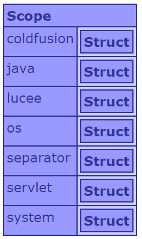
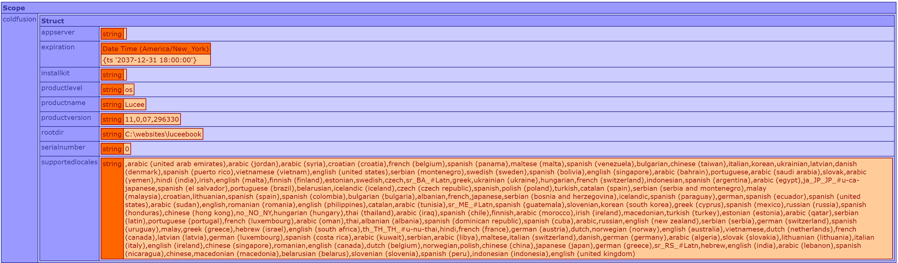
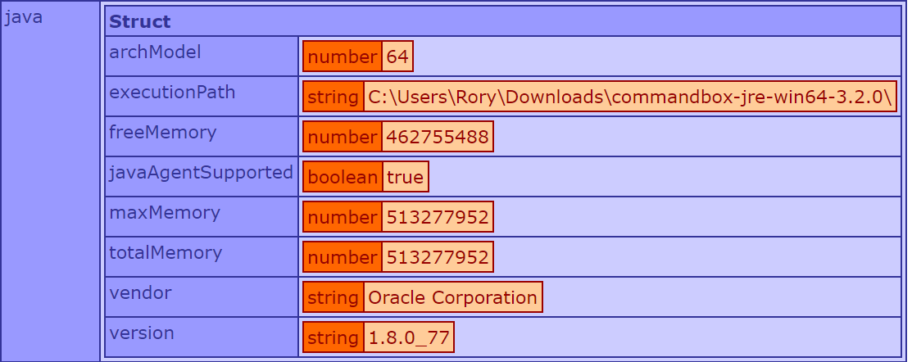
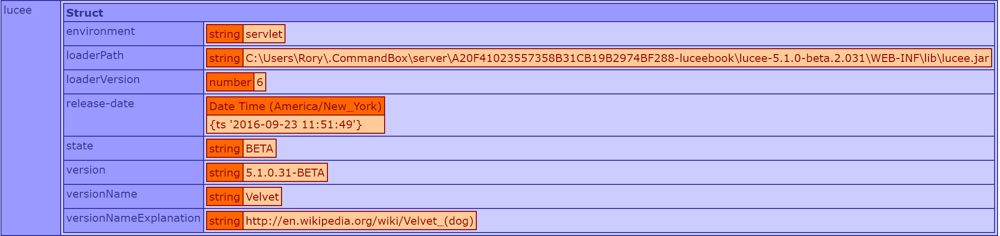
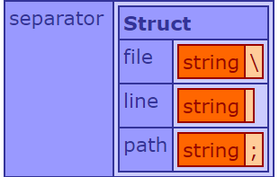
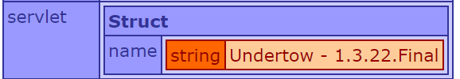
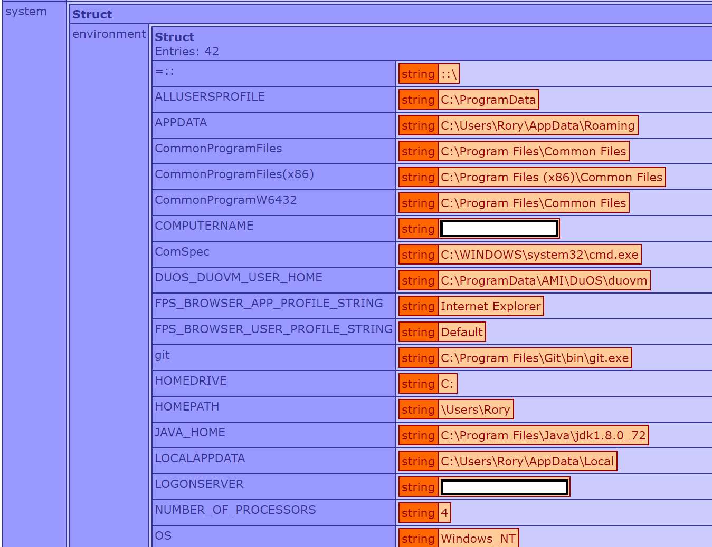
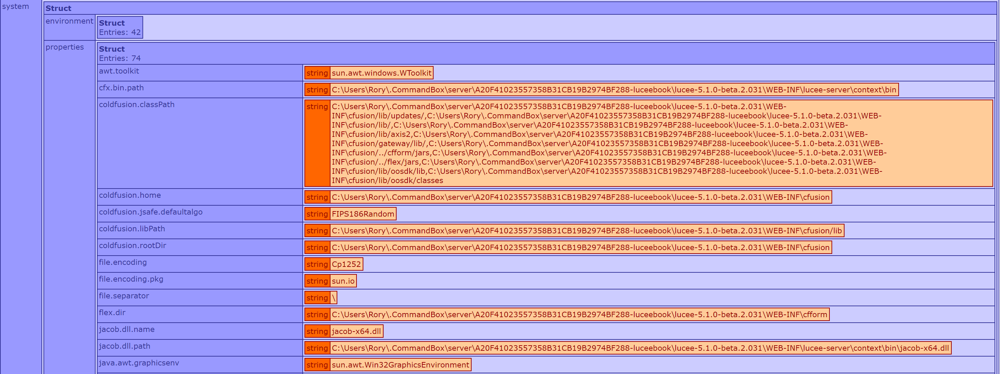

# Server Scope
Lucee makes available a Server scope which contains a lot of useful information about the running Lucee server. The specific details returned depend on the operating system running Lucee. These examples below are run on Windows.

##Dumping the server scope
To quickly see what is in the server scope, use `writeDump()`:



It will return a structure. A sample of each section will be described below.

###Coldfusion

###java
General information about the running java process 

###lucee
Information about the Lucee process and version

###os
Information about the Operating System running Lucee

###seperator

Use these seperators to have a cross OS compatible way to create file paths, read files by line, and list file paths.

####seperator.file
The character that is used by the OS when pathing to files. Windows is `\` and Mac & Linux are `/`

####seperator.line
How line breaks and carriage returns are handled in each OS. Use this when parsing files into an array or ther means which needs OS compatability.

####seperator.path
How the system separates files paths in a string. This is used primary in OS environment variables. 

###servlet
Information about the servlet running Lucee

###system.environment
The Operating System environment variables picked up by Lucee when Lucee was started.

###system.properties
The Java configuration properties ready by Lucee when Lucee was started.

