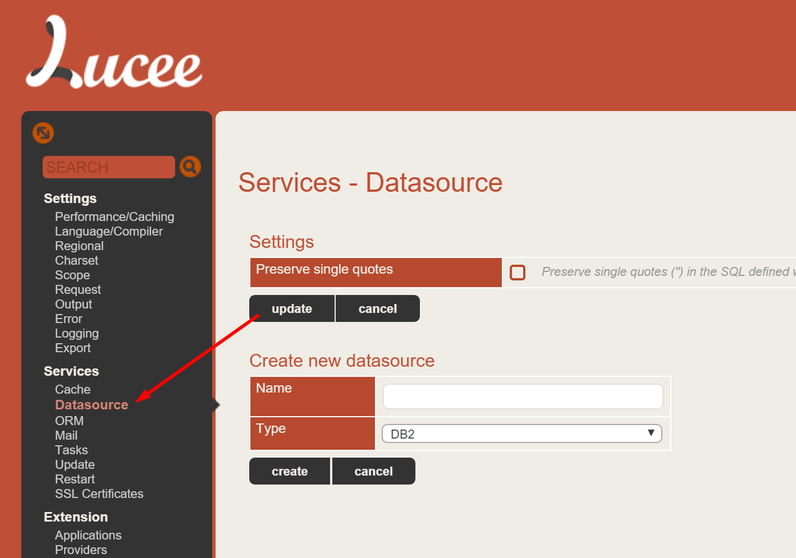
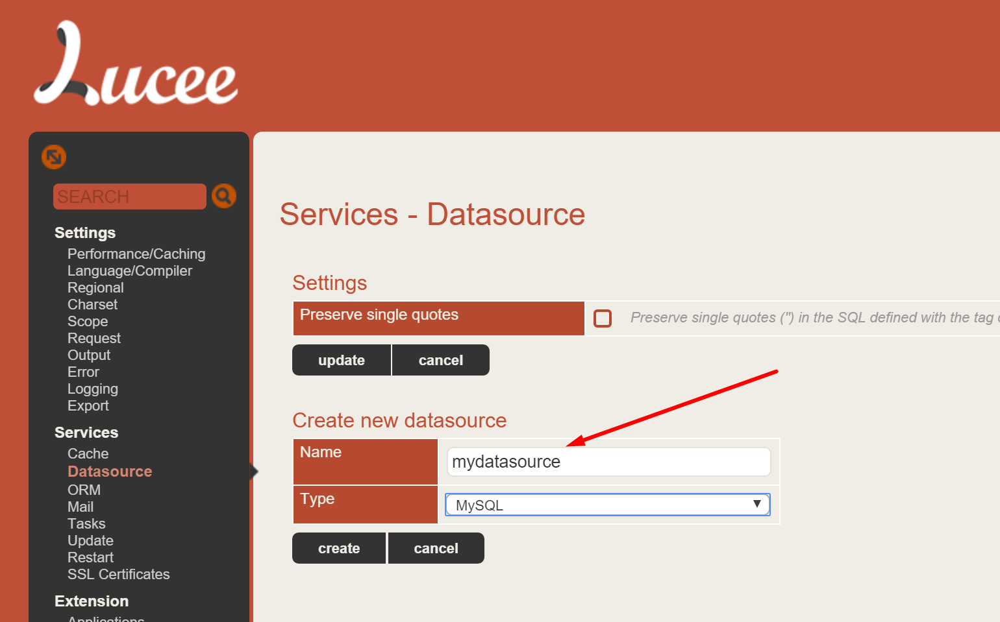
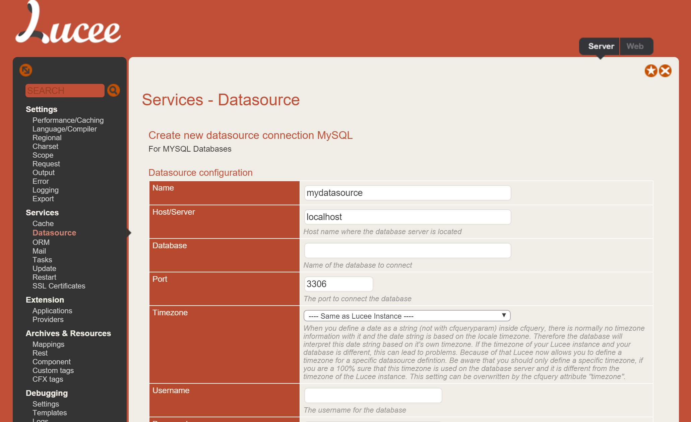
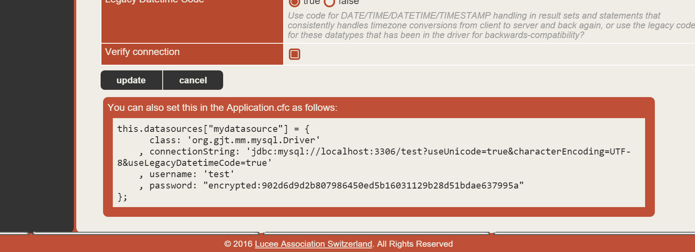

# SQL/RDBMs

Lucee has native integration with every popular SQL database on the market and can communicate with any JDBC compliant database driver. The default installed drivers are for these databases:

* DB2
* Firebird
* H2 Database Engine in Embedded Mode
* H2 Database Engine in Server Mode
* HSQLDB (Hypersonic SQL DB)
* MSSQL - Microsoft SQL Server (Vendor Microsoft)
* MSSQL - Microsoft SQL Server (Vendor jTDS)
* MySQL
* JDBC-ODBC Bridge (for Access,MSSQL)
* Oracle
* Other - JDBC Driver
* PostgreSQL
* Sybase

##Configuring Datasources
Access to the SQL database is setup by configuring a datasource in the Lucee Admin or in your Application.cfc

###Lucee Admin

To configure a Datasource for your [Web Context](https://rorylaitila.gitbooks.io/lucee/content/lucee_context.html#web-context), or for all websites via the [Server Context](https://rorylaitila.gitbooks.io/lucee/content/lucee_context.html#server-context):

1. >log into the Lucee Admin and go to Datasources. 



2. > Enter a name for your datasource and select the Type of datasource it is



3. > Configure your datasource with the appropriate settings.




###Application.cfc Configuration
The entire datasource can be configured in your Application.cfc so that your datasource is portable without needing to manually configure in the admin. The easiest way to do this is to setup the datasource in the admin in the above example, and then copy the config that the Admin gives you.

1. > Setup the datasource as described in the Lucee Admin section
2. > Edit your datasource that you created, and at the bottom Lucee will tell you the configuration that you can put into your Application.cfc



Copy this into your [Application.cfc](https://rorylaitila.gitbooks.io/lucee/content/applicationcfc_lifecycle.html), which should at a minimum then look like:

Application.cfc
```
component {

  this.name="myApp";
  this.datasources["mydatasource"] = {
	  class: 'org.gjt.mm.mysql.Driver'
	, connectionString: 'jdbc:mysql://localhost:3306/test?useUnicode=true&characterEncoding=UTF-8&useLegacyDatetimeCode=true'
	, username: 'test'
	, password: "encrypted:902d6d9d2b807986450ed5b16031129b28d51bdae637995a"
};

}
```


