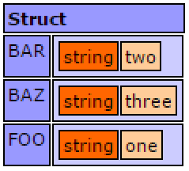
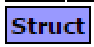
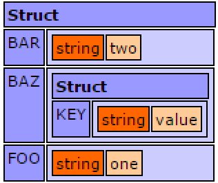
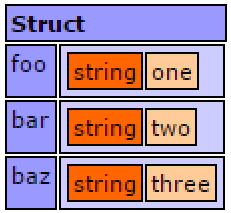
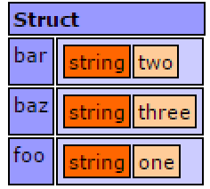

# Structs

Structs in Lucee are containers for data where there is a 'key' that references a 'value'. When dumping a struct it looks like:

The default type of structure created with the notation below is unordered, such that when looping over the keys in the struct, or dumping the struct, the data may appear in any order. To mainain the order of keys when adding, the structNew() function must be used.

##Creating Structs

###An Empty Struct


When dumped an empty struct has no data:

###With Data


Struct Dump:

###With Nested Data

Structs can infinitely next structs and complex data type (arrays can nest structs too)



Nested Struct Dump:

##Creating an Ordered Struct

Use the structNew() function to create an ordered struct which maintains the order of the keys when looping, dumping or serializing.



Dump of an Ordered Struct:

##Inserting Items into an Existing Struct



##Dumping a Struct



In the preceeding example, all of the keys were uppercased when dumped. While Lucee is case insensitive, it will convert all keys to uppercase when serializing or dumping. To preseve case, make the new names quoted:



##Referencing Struct Keys


##Dynamically Referencing Keys


##Looping Structs

###For in Loop


###Each Loop


##Advanced Struct Usage

Structs have many functions, see all uses here: http://luceedocs.herokuapp.com/objects

>Note: The member functions available on the struct object like .insert() duplicate the older "Built in Function" (BIF) style (like structInsert()). Modern convention is to use the new style, but the old BIFs are still provided for compatibility with older versions of Lucee.