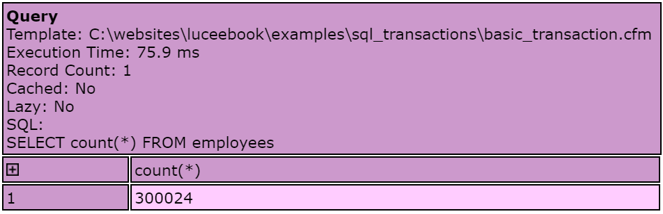

# Transactions
Lucee supports SQL transactions via the use of the `transaction {}` block. It is best practice to use transactions with SQL  queries. Doing so ensures consistency with your database access. 

##Basic Transaction
This example shows the most basic transaction syntax. But since this is a SELECT statement, nothing is being modified. Technically a transaction provides no database benefit here for selects, but it is important to be in the habit of combining SQL statements into transactions.

<noscript>
```
<cfscript>
transaction {
	query name='employeeCount' {
		echo("SELECT count(*) FROM employees");
	}
}
writeDump(employeeCount);
</cfscript>
```
</noscript>

The dump would result in:



##Transaction with Changes

